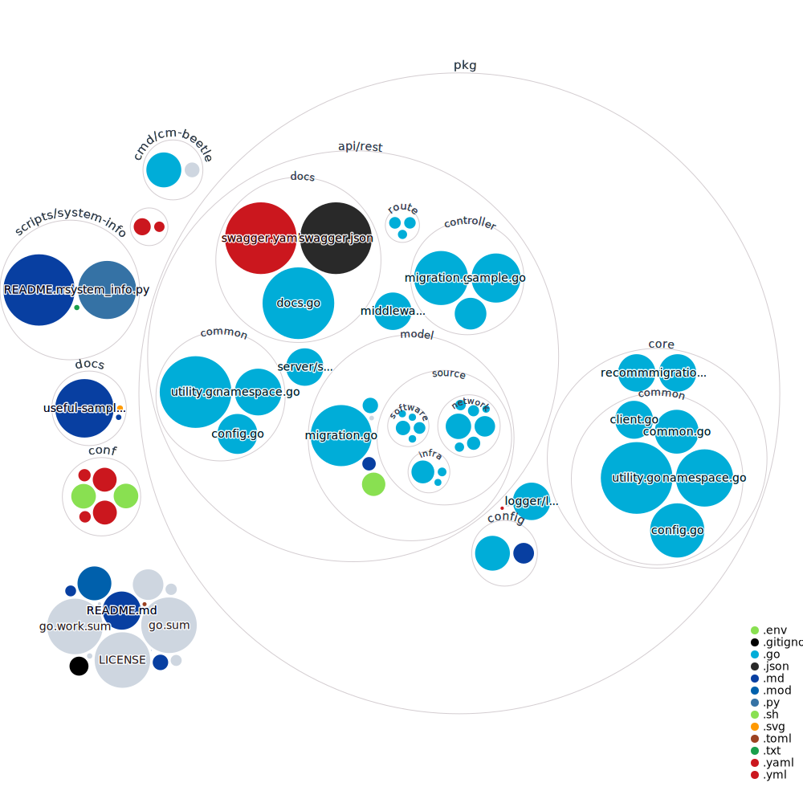

# Computing Infrastructure Migration

This repository provides computing infrastructure migration features.
This is a sub-system on [Cloud-Barista platform](https://github.com/cloud-barista/docs)
and utilizes [CB-Tumblebug](https://github.com/cloud-barista/cb-tumblebug)
to depoly a multi-cloud infra as a target computing infrastructure.

## Overview

Computing Infrastructure Migration framework (codename: cm-beetle) is going to support:

- migration execution and control from source to target computing infrastructure, and
- recommendation of optimal configuration of target cloud infrastructure.

## Migration Support Status Summary

The tables below show recommendation and migration support by target CSP and resource type.

Legend

| Icon | Meaning                                    |
| :--: | ------------------------------------------ |
|  ✅  | Fully supported                            |
|  ⚠️  | Supported with known issues or limitations |
|  🚧  | In progress                                |
|  📅  | Planned                                    |
|  ❌  | Not available                              |
|  —   | Not planned                                |

> **(CSP)** — Low priority or not pursued this year.

| Resource        | AWS | Azure | GCP | Alibaba | Tencent | IBM | OpenStack | NCP | NHN | KT  |
| --------------- | :-: | :---: | :-: | :-----: | :-----: | :-: | :-------: | :-: | :-: | :-: |
| VNet            | ✅  |  ✅   | ✅  |   ✅    |   📅    | 🚧  |    📅     | ✅  |  —  |  —  |
| Subnet          | ✅  |  ✅   | ✅  |   ✅    |   📅    | 🚧  |    📅     | ✅  |  —  |  —  |
| Security Group  | ✅  |  ✅   | ✅  |   ✅    |   📅    | 🚧  |    📅     | ✅  |  —  |  —  |
| SSH Key         | ✅  |  ✅   | ✅  |   ✅    |   📅    | 🚧  |    📅     | ✅  |  —  |  —  |
| VM Spec         | ✅  |  ✅   | ✅  |   ✅    |   📅    | 🚧  |    📅     | ✅  |  —  |  —  |
| VM Image        | ✅  |  ✅   | ✅  |   ✅    |   📅    | 🚧  |    📅     | ✅  |  —  |  —  |
| Virtual Machine | ✅  |  ✅   | ✅  |   ⚠️    |   📅    | 🚧  |    📅     | ✅  |  —  |  —  |
| K8s Cluster     | 🚧  |  🚧   | 🚧  |   🚧    |   🚧    | 🚧  |    ❌     |  —  |  —  | ❌  |
| K8s Node Image  | 🚧  |  🚧   | 🚧  |   🚧    |   🚧    | 🚧  |    ❌     |  —  |  —  | ❌  |
| Object Storage  | ✅  |  ✅   | ✅  |   ✅    |   ✅    | ✅  |    ✅     | ✅  | ✅  | ✅  |
| NLB             | 🚧  |  🚧   | 🚧  |   🚧    |   📅    | 🚧  |    📅     | 🚧  | 📅  | 📅  |
| DBMS            | 📅  |  📅   | 📅  |   📅    |   📅    | 📅  |    📅     | 📅  | 📅  | 📅  |

**Data Migration · Incubating**

Data migration transfers data between storage endpoints regardless of which CSP hosts them.

| Source                         | Destination                    | Supported |
| ------------------------------ | ------------------------------ | :-------: |
| Filesystem (SSH/rsync)         | Filesystem (SSH/rsync)         |    ✅     |
| Filesystem (SSH/rsync)         | Object Storage (S3-compatible) |    ✅     |
| Object Storage (S3-compatible) | Object Storage (S3-compatible) |    ✅     |
| Object Storage (S3-compatible) | Filesystem (SSH/rsync)         |    ✅     |

### Feature Guides

- [VM Infrastructure](docs/feature-guide/vm-infrastructure.md)
- [Kubernetes Infrastructure](docs/feature-guide/kubernetes-infrastructure.md)
- [Managed Middleware](docs/feature-guide/managed-middleware.md)
- [Object Storage Migration](docs/feature-guide/object-storage-migration-feature-guide.md)
- [Data Migration](docs/feature-guide/data-migration-feature-guide.md)

## Execution and development environment

- Operating system (OS):
  - Ubuntu 22.04
- Languages:
  - Go: 1.26.2+
  - Python: 3.10.12
- Container runtime:
  - Docker: 24.0.7

## How to run and use CM-Beetle

1. [How to deploy CM-Beetle, along with its related components](https://github.com/cloud-barista/cm-beetle/discussions/105)

Note - Deprecated, [How to run and use the CM-Beetle](https://github.com/cloud-barista/cm-beetle/discussions/73)

---

#### Visualization of the codebase

> How can we “fingerprint” a codebase to see its structure at a glance?
> Let’s explore ways to automatically visualize a GitHub repo,
> and how that could be useful. - [Visualizing a Codebase](https://githubnext.com/projects/repo-visualization/)

[Explore CM-Beetle codebase](https://mango-dune-07a8b7110.1.azurestaticapps.net/?repo=cloud-barista%2Fcm-beetle)

Note - this is automatically generated by [Repo Visualizer](https://github.com/marketplace/actions/repo-visualizer)

CM-Beetle is interested in [Potential future directions](https://githubnext.com/projects/repo-visualization/#potential-future-directions)
