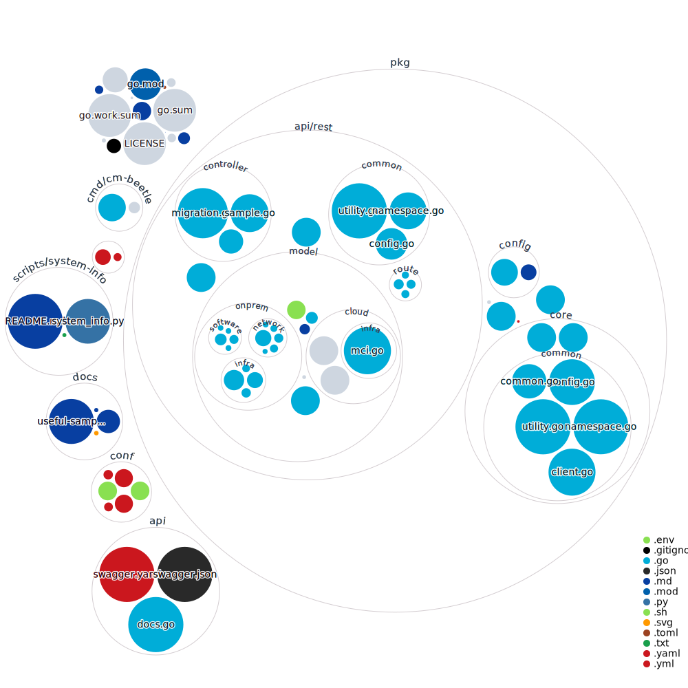

# Computing Infrastructure Migration

This repository provides computing infrastructure migration features.
This is a sub-system on [Cloud-Barista platform](https://github.com/cloud-barista/docs)
and utilizes [CB-Tumblebug](https://github.com/cloud-barista/cb-tumblebug)
to depoly a multi-cloud infra as a target computing infrastructure.

## Overview

Computing Infrastructure Migration framework (codename: cm-beetle) is going to support:
- migration execution and control from source to target computing infrastructure, and
- recommendation of optimal configuration of target cloud infrastructure.

## Execution and development environment

- Operating system (OS): 
    - Ubuntu 22.04
- Languages: 
    - Go: 1.21.6
    - Python: 3.10.12
- Container runtime:
    - Docker: 24.0.7

## How to run and use CM-Beetle

See [the discussion #73](https://github.com/cloud-barista/cm-beetle/discussions/73)

---

#### Visualization of the codebase

> How can we “fingerprint” a codebase to see its structure at a glance? 
> Let’s explore ways to automatically visualize a GitHub repo, 
> and how that could be useful. - [Visualizing a Codebase](https://githubnext.com/projects/repo-visualization/)

[Explore CM-Beetle codebase](https://mango-dune-07a8b7110.1.azurestaticapps.net/?repo=cloud-barista%2Fcm-beetle)

Note - this is automatically generated by [Repo Visualizer](https://github.com/marketplace/actions/repo-visualizer) 

CM-Beetle is interested in [Potential future directions](https://githubnext.com/projects/repo-visualization/#potential-future-directions)
