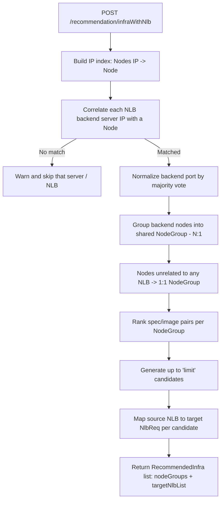
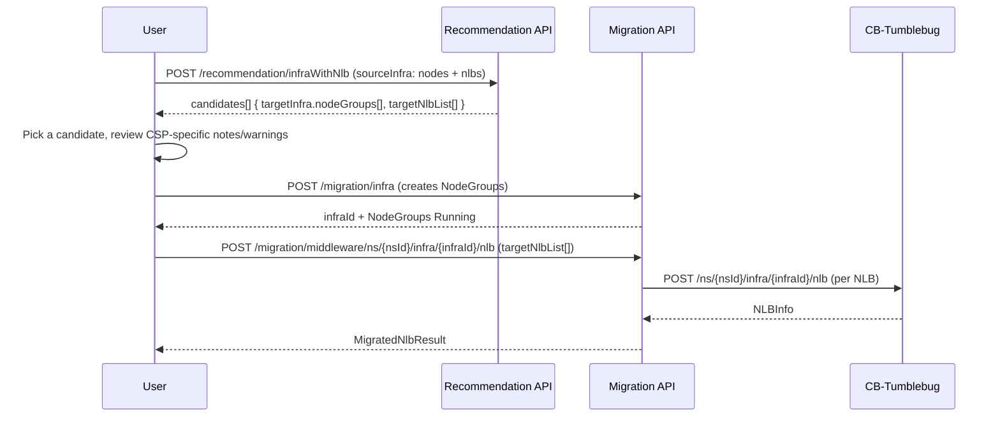

# Network Load Balancer (NLB) Feature Guide

> **Status:** Preview — endpoints are tagged `(Preview)` in Swagger and may change.

## Overview

CM-Beetle provides NLB-aware recommendation and migration for software load balancers running in
the source environment. Today the source software is HAProxy, collected by the cm-honeybee Agent;
CM-Beetle correlates the HAProxy configuration with the source Nodes and maps it onto a managed
cloud NLB (AWS ELB/NLB, Azure Load Balancer, GCP Load Balancing, etc.) in the target infrastructure.

This feature enables you to:

- **Recommend** infrastructure candidates where backend nodes are grouped for NLB compatibility, together with the target NLB configuration
- **Correlate** HAProxy backend servers with source Nodes purely by IP address — no manual tagging required
- **Migrate** the recommended NLBs into an already-migrated target Infra
- **Manage** created NLBs — list, inspect, live health-check, and delete

NLB migration always happens **after** infra migration: infra migration creates the NodeGroups, and
NLB migration attaches load balancers to them by NodeGroup ID.

## Support Status

| CSP       | Support | Notes                                                                      |
| --------- | :-----: | --------------------------------------------------------------------------- |
| AWS       |   ✅    | Port translation supported. DNS endpoint — allow ~5 min for propagation.     |
| Azure     |   ✅    | Port translation supported. DNS + static IP. Health-check timeout auto-omitted (not supported by Azure). |
| GCP       |   ✅    | No port translation — listener port is forced equal to the backend port. IP-only endpoint (no DNS name). |
| Alibaba   |   ✅    | —                                                                            |
| IBM       |   ✅    | Port translation supported. Listener address assigned asynchronously — re-query if empty after migration. |
| NCP       |   ✅    | —                                                                            |
| Tencent   |   📅    | Planned                                                                      |
| OpenStack |   📅    | Planned                                                                      |
| NHN       |   📅    | Planned                                                                      |
| KT        |   📅    | Planned                                                                      |

## Source Model: On-Premise NLB (HAProxy)

The cm-honeybee Agent parses `/etc/haproxy/haproxy.cfg` and reports one `NlbProperty` entry per
HAProxy frontend–backend pair on `OnpremInfra.nlbs[]`.

| Field                   | Description                                                                |
| ----------------------- | --------------------------------------------------------------------------- |
| `hostMachineId`         | ID of the Node running HAProxy (cross-references `Nodes[].id`)              |
| `software`              | NLB software, currently `"haproxy"` — metadata only, does not affect recommendation logic |
| `listener.bindAddress`  | `"*"` (all interfaces) → target NLB `type = PUBLIC`; a specific IP → `INTERNAL` |
| `listener.port`         | Frontend listener port                                                      |
| `listener.protocol`     | `tcp` \| `udp`                                                               |
| `backend.name`          | HAProxy backend section name                                                 |
| `backend.balance`       | Load-balancing algorithm (`roundrobin`, etc.) — reference only; cloud NLBs don't accept a custom algorithm, so the CSP default is used and a warning is added |
| `backend.protocol`      | `tcp` \| `http`                                                              |
| `backend.servers[]`     | Backend server list — `name`, `ip`, `port`, optional `weight` (reference only) |
| `healthCheck`           | `enabled`, `protocol`, `port`, `interval`, `timeout`, `threshold`            |

A single HAProxy instance can front multiple services, so `nlbs[]` is a list — one entry per
frontend-backend pair, all sharing the same `hostMachineId`.

## NLB-Aware Infrastructure Recommendation

### What It Does

`POST /recommendation/infraWithNlb` performs infrastructure recommendation the same way as
`POST /recommendation/infra`, but additionally:

1. Correlates each NLB backend server's IP with a source Node IP
2. Normalizes backend ports via majority vote when servers on the same backend use different ports
3. Groups NLB-backend nodes into shared NodeGroups (N:1); nodes unrelated to any NLB keep the existing 1:1 grouping
4. Finds ranked spec/image pairs per NodeGroup (using a representative node for NLB-backed groups) and generates up to `limit` Pareto-style candidates
5. Maps the source NLB configuration onto the target CSP's NLB request shape (`targetNlbList`), identically across all candidates

The existing `POST /recommendation/infra` endpoint is unchanged and does not require `nlbs[]` —
full backward compatibility is preserved.

### How It Works



### API Reference

**Endpoint:** `POST /recommendation/infraWithNlb`

| Parameter        | Type    | Location | Required | Description                                                    |
| ---------------- | ------- | -------- | -------- | ---------------------------------------------------------------- |
| `desiredCsp`     | string  | query    | No       | Target CSP (`aws`, `azure`, `gcp`, `alibaba`, `ncp`); overrides body |
| `desiredRegion`  | string  | query    | No       | Target region; overrides body                                    |
| `limit`          | int     | query    | No       | Maximum candidates to return (default `5`)                       |
| `minMatchRate`   | number  | query    | No       | Minimum match rate 0–100 for "highly matched" classification (default `90.0`) |
| request body     | JSON    | body     | Yes      | `desiredCsp`, `desiredRegion`, `sourceInfra` (nodes + nlbs)       |
| `Prefer`         | header  | header   | No       | `respond-async` runs the recommendation asynchronously (see below) |

**Request Body Schema:**

```json
{
  "desiredCsp": "aws",
  "desiredRegion": "ap-northeast-2",
  "sourceInfra": {
    "nodes": [
      { "hostname": "web-01", "machineId": "node-a", "interfaces": [{ "ipv4CidrBlocks": ["10.0.1.10/24"] }] },
      { "hostname": "web-02", "machineId": "node-b", "interfaces": [{ "ipv4CidrBlocks": ["10.0.1.20/24"] }] }
    ],
    "nlbs": [
      {
        "hostMachineId": "node-haproxy",
        "software": "haproxy",
        "listener": { "bindAddress": "*", "port": 80, "protocol": "tcp" },
        "backend": {
          "name": "web_back",
          "balance": "roundrobin",
          "protocol": "tcp",
          "servers": [
            { "name": "web1", "ip": "10.0.1.10", "port": 80 },
            { "name": "web2", "ip": "10.0.1.20", "port": 80 }
          ]
        },
        "healthCheck": { "enabled": true, "interval": 10, "timeout": 10, "threshold": 3 }
      }
    ]
  }
}
```

**Response:** `200 OK` with `[]RecommendedInfra`. Each candidate includes `targetInfra.nodeGroups[]`
(NodeGroup IDs to reuse at infra-migration time) and `targetNlbList[]` (ready for the migration API):

```json
{
  "success": true,
  "message": "1 candidate(s) recommended — each with 1 NLB(s) and 1 NodeGroup(s)",
  "data": [
    {
      "status": "recommended",
      "targetCloud": { "csp": "aws", "region": "ap-northeast-2" },
      "targetInfra": { "nodeGroups": [{ "name": "ng-web-back", "...": "..." }] },
      "targetNlbList": [
        {
          "type": "PUBLIC",
          "scope": "REGION",
          "listener": { "protocol": "TCP", "port": "80" },
          "targetGroup": { "protocol": "TCP", "port": "80", "nodeGroupId": "ng-web-back" },
          "healthChecker": { "interval": 10, "threshold": 3, "timeout": 10 }
        }
      ]
    }
  ]
}
```

Use the same `targetInfra.nodeGroups[].name` value as the NodeGroup ID when calling
`POST /migration/infra`, so the NLB migration step below can reference it immediately.

### CSP-Specific Notes

- **AWS** — Port translation supported (e.g., listener `9999` → backend `8086`). DNS endpoint; allow ~5 min for propagation after creation. A security group rule for the backend port is opened automatically from `0.0.0.0/0`.
- **Azure** — Port translation supported. DNS name + static IP endpoint. Health-check timeout is auto-omitted (not supported by Azure).
- **GCP** — Port translation **not** supported — the listener port is forced equal to the backend port, so clients must connect on the application port (e.g., `8086`, not `9999`). IP-only endpoint (no DNS name).
- **IBM** — Port translation supported. The listener address is assigned asynchronously — re-query if it's empty right after migration. Health-check timeout is forced strictly less than the interval.

### Async Recommendation

Like other CM-Beetle APIs, send header `Prefer: respond-async` to run the recommendation in the
background: the API replies `202 Accepted` with a `reqId`, poll `GET /request/{reqId}` for the
result (`Handling` → `Success` / `Error`). See [Async Responses](async-responses.md).

## NLB Migration

### What It Does

`POST /migration/middleware/ns/{nsId}/infra/{infraId}/nlb` creates the NLBs described in
`targetNlbList` inside an existing, already-migrated Infra.

**Prerequisites:**

- The Namespace (`nsId`) must exist.
- The Infra (`infraId`) must exist with at least one NodeGroup in `Running` state.
- Each `targetNlbList[].targetGroup.nodeGroupId` must match a NodeGroup ID that actually exists in that Infra.

Run infra migration first (`POST /migration/infra`, using the same NodeGroup IDs returned by the
recommendation step), then run NLB migration.

### API Reference

**Endpoint:** `POST /migration/middleware/ns/{nsId}/infra/{infraId}/nlb`

| Parameter      | Type   | Location | Required | Description                                                                 |
| -------------- | ------ | -------- | -------- | ----------------------------------------------------------------------------- |
| `nsId`         | string | path     | Yes      | Namespace ID                                                                   |
| `infraId`      | string | path     | Yes      | Target Infra ID (NodeGroups already created)                                   |
| `useExisting`  | bool   | query    | No       | Reuse an existing NLB already targeting the same `nodeGroupId` instead of creating a new one (default `true`) |
| request body   | JSON   | body     | Yes      | `RecommendedNlb` — use `targetNlbList[]` from the recommendation response as-is |
| `Prefer`       | header | header   | No       | `respond-async` runs the migration asynchronously                             |

**Request Body:** same shape as the recommendation response's `targetNlbList[]`, wrapped as:

```json
{
  "targetNlbList": [
    {
      "type": "PUBLIC",
      "scope": "REGION",
      "listener": { "protocol": "TCP", "port": "80" },
      "targetGroup": { "protocol": "TCP", "port": "80", "nodeGroupId": "ng-web-back" },
      "healthChecker": { "interval": 10, "threshold": 3, "timeout": 10 }
    }
  ]
}
```

**Response:** `201 Created` with `MigratedNlbResult` (all NLBs are attempted independently — partial
success is possible):

```json
{
  "success": true,
  "message": "1 NLB(s) created successfully.",
  "data": {
    "status": "created",
    "description": "1 NLB(s) created successfully.",
    "nlbList": [
      {
        "id": "nlb-01",
        "name": "nlb-01",
        "type": "PUBLIC",
        "listener": { "protocol": "TCP", "port": "80", "dnsName": "nlb-xxxx.elb.ap-northeast-2.amazonaws.com" },
        "targetGroup": { "protocol": "TCP", "port": "80", "nodeGroupId": "ng-web-back" },
        "status": "Active"
      }
    ]
  }
}
```

### Example

```bash
curl -X POST "http://localhost:8056/api/v1/migration/middleware/ns/mig01/infra/infra01/nlb" \
  -H "Content-Type: application/json" \
  -d @targetNlbList.json
```

Run asynchronously instead:

```bash
curl -X POST "http://localhost:8056/api/v1/migration/middleware/ns/mig01/infra/infra01/nlb" \
  -H "Content-Type: application/json" -H "Prefer: respond-async" \
  -d @targetNlbList.json
# -> 202 Accepted { "reqId": "...", "statusUrl": "/beetle/request/..." }
```

## NLB Management APIs

| Operation          | Method & Path                                                    | Notes                                                                 |
| ------------------- | ----------------------------------------------------------------- | ---------------------------------------------------------------------- |
| List NLBs           | `GET /migration/middleware/ns/{nsId}/infra/{infraId}/nlb`          | All NLBs in the namespace/infra                                        |
| Get NLB             | `GET /migration/middleware/ns/{nsId}/infra/{infraId}/nlb/{nlbId}`  | Cached state                                                            |
| Get NLB health      | `GET /migration/middleware/ns/{nsId}/infra/{infraId}/nlb/{nlbId}/healthz` | Live check against the CSP (unlike Get, which returns cached state) |
| Delete NLB          | `DELETE /migration/middleware/ns/{nsId}/infra/{infraId}/nlb/{nlbId}` | Waits ~15s after a successful CSP delete response before returning, to let CSP-side cleanup (e.g., ENI release) finish — avoids `DependencyViolation` errors if VNet/subnet deletion follows immediately. Supports `Prefer: respond-async`. |

## Migration Workflow



## Constraints and Considerations

| Item                              | Behavior                                                                                                   |
| ---------------------------------- | -------------------------------------------------------------------------------------------------------- |
| **Scope**                          | Node-level (R-NLB) load balancing only. A backend server IP that isn't a source Node's IP (e.g., a Pod IP) can't be resolved. |
| **Unresolvable backend server**    | Warned and skipped; if *no* server in a backend resolves to a Node, that NLB is skipped entirely.          |
| **Port mismatch across servers**   | Normalized by majority vote; the normalization is recorded as a warning.                                    |
| **Node in multiple NLB backends**  | A separate VM is provisioned per NodeGroup/backend (role separation) — the source node count and target VM count can differ. Recorded as a warning. |
| **Load-balancing algorithm**       | `roundrobin`/`leastconn`/etc. can't be set on a cloud NLB directly — the CSP default algorithm is used, recorded as a warning. |
| **Health checker fields**          | CB-Tumblebug's `healthChecker` only accepts `interval`/`threshold`/`timeout` — not `protocol` or `port`.    |
| **Spec heterogeneity**             | Nodes sharing a NodeGroup with different specs are currently unified via **upsizing** (largest spec wins); not yet user-configurable. |
| **Source software**                | Only HAProxy is collected today; `software` is metadata and doesn't change the recommendation logic.        |

## References

### API Documentation

- **Swagger UI:** `http://localhost:8056/api/v1/swagger/index.html` (tag: `[Recommendation] Infrastructure`, `[Migration] Managed Network Load Balancer (NLB) - preview`)
- **Swagger YAML:** `api/swagger.yaml`

### Source Code

- **Recommendation handler:** [pkg/api/rest/controller/recommendation.go](../../pkg/api/rest/controller/recommendation.go)
- **Recommendation core logic:** [pkg/core/recommendation/infra-with-nlb.go](../../pkg/core/recommendation/infra-with-nlb.go)
- **Migration handler:** [pkg/api/rest/controller/migration-nlb.go](../../pkg/api/rest/controller/migration-nlb.go)
- **Migration core logic:** [pkg/core/migration/nlb.go](../../pkg/core/migration/nlb.go)
- **Tumblebug client:** [pkg/client/tumblebug/nlb.go](../../pkg/client/tumblebug/nlb.go)
- **Source NLB model:** [imdl/on-premise-model/nlb.go](../../imdl/on-premise-model/nlb.go)
- **Target NLB model:** [imdl/cloud-model/nlb-info.go](../../imdl/cloud-model/nlb-info.go), [imdl/cloud-model/copied-tb-model.go](../../imdl/cloud-model/copied-tb-model.go)

### Related Documentation

- [Infrastructure Feature Guide](infrastructure.md)
- [Async Responses](async-responses.md)
- [API Development Guide](../api-development-guide.md)
- [cm-honeybee discussion #55 — HAProxy raw data example](https://github.com/cloud-barista/cm-honeybee/discussions/55)
