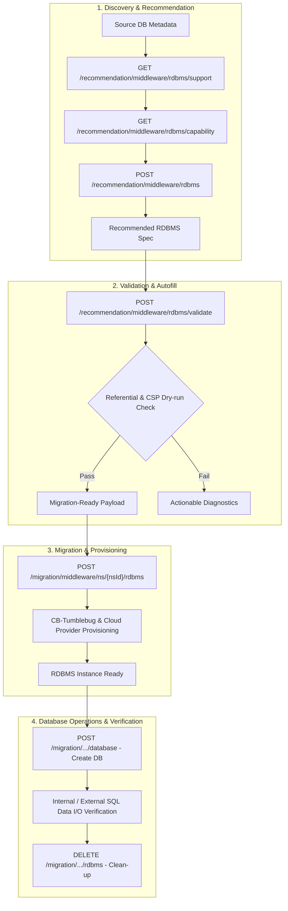

# Managed RDBMS (RDS) Feature Guide

## Overview

CM-Beetle provides end-to-end **Managed RDBMS (Relational Database Service)** recommendation, validation, and migration capabilities for heterogeneous multi-cloud environments. This feature empowers users to transition on-premises or existing cloud databases to optimal managed database services (e.g., AWS RDS, Google Cloud SQL, Azure Database, Alibaba ApsaraDB, Tencent CDB, IBM Cloud Databases, NCP Cloud DB, NHN RDS) with zero guesswork.

Key capabilities include:

- **Capability-Driven Recommendation**: Evaluates source database parameters (engine, version, vCPU, memory, storage) and maps them to the optimal target CSP DB instance spec and configuration using real-time CSP capability metrics.
- **Pre-flight & Referential Validation**: Performs multi-tier dry-run validations against CSP API rules and referential integrity (e.g., matching VNet/Subnet/SecurityGroup connection profiles) before touching cloud resources.
- **Automated Migration & Provisioning**: Seamlessly deploys managed database clusters and instances via CB-Tumblebug with robust state tracking.
- **Logical Database Lifecycle Management**: Supports creation, listing, and deletion of logical tenant databases inside the provisioned RDBMS instance.
- **Data I/O Verification**: Supports end-to-end connectivity and SQL I/O verification for both public-accessible and private-isolated database topologies.

---

## Architecture & Workflow

The Managed RDBMS workflow spans from initial capability discovery to post-migration database operations:



---

## CSP Support Matrix

CM-Beetle Managed RDBMS has been verified across 8 major Cloud Service Providers (CSPs):

| CSP         | Service Brand                       | Supported DB Engines       |   Access Mode    | Subnet Requirement                              | Provisioning Characteristics                                   |
| :---------- | :---------------------------------- | :------------------------- | :--------------: | :---------------------------------------------- | :------------------------------------------------------------- |
| **AWS**     | Amazon RDS                          | MySQL, MariaDB, PostgreSQL | Public / Private | Multi-AZ Subnet Group (>= 2 subnets across AZs) | High availability and automated failover                       |
| **Azure**   | Azure Database for MySQL/PostgreSQL | MySQL, PostgreSQL          | Public / Private | Single or Multi-Subnet                          | Flexible server architecture                                   |
| **GCP**     | Google Cloud SQL                    | MySQL, PostgreSQL          | Public / Private | Authorized Networks / VPC Peering               | Highly performant storage scaling                              |
| **Alibaba** | Alibaba Cloud ApsaraDB              | MySQL, MariaDB, PostgreSQL | Public / Private | VNet Subnet Binding                             | Broad engine version choices                                   |
| **Tencent** | Tencent Cloud CDB                   | MySQL, MariaDB, PostgreSQL | Public / Private | Multi-AZ VPC Subnet Group                       | Fast regional provisioning                                     |
| **IBM**     | IBM Cloud Databases (ICD)           | MySQL, PostgreSQL          | Public / Private | Resource Group / VPC bound                      | Asynchronous provisioning (~20-25m) with robust status polling |
| **NCP**     | NAVER Cloud DB                      | MySQL, PostgreSQL          |   Private Only   | Single Subnet + Dedicated DB Port               | Private access enforced; verified via Internal Runner VM       |
| **NHN**     | NHN Cloud RDS                       | MySQL, MariaDB, PostgreSQL | Public / Private | Standard VPC Subnet                             | Inbound security group rules required                          |

---

## API Reference

### 1. Discovery & Recommendation APIs

#### 1.1 Get CSP Support Matrix

Retrieve supported database engines, features, and operation methods across all or specific CSPs.

- **Endpoint**: `GET /recommendation/middleware/rdbms/support`
- **Query Parameter**:
  - `providerName` (optional): Filter by CSP provider (e.g., `aws`, `azure`, `gcp`, `ibm`, `ncp`, `nhn`).

**Sample Request**:

```http
GET /beetle/recommendation/middleware/rdbms/support?providerName=aws HTTP/1.1
Host: localhost:8056
Authorization: Basic <credentials>
```

**Sample Response**:

```json
{
  "resourceType": "rdbms",
  "supports": {
    "aws": {
      "supported": true,
      "supportedDBEngines": ["mysql", "mariadb"],
      "dbOperationMethod": "sqlFallback",
      "supportsTag": true,
      "storageTypeSelectable": true
    }
  }
}
```

---

#### 1.2 Get Real-time Capability Options

Fetch live DB instance spec catalogs, supported engine versions, and storage configurations for a given connection.

- **Endpoint**: `GET /recommendation/middleware/rdbms/capability`
- **Query Parameter**:
  - `connectionName` (required): Target cloud connection name (e.g., `aws-ap-northeast-2`).

**Sample Response**:

```json
{
  "resourceType": "rdbms",
  "connectionName": "aws-ap-northeast-2",
  "supportedDBEngines": ["mysql", "mariadb"],
  "dbmsRequirements": {
    "mysql": {
      "referenceDBInstanceSpec": "db.t3.medium",
      "rootDiskType": "gp2",
      "rootDiskSize": "100"
    }
  },
  "dbInstanceSpecs": [
    {
      "cspSpecName": "db.t3.medium",
      "vCPU": 2,
      "memoryGiB": 4.0
    }
  ]
}
```

---

#### 1.3 Recommend Managed RDBMS

Recommends optimal target RDBMS specifications based on source database workloads and desired cloud properties.

- **Endpoint**: `POST /recommendation/middleware/rdbms`
- **Request Body**: `RDBMSRecommendationRequest`

**Sample Request**:

```json
{
  "desiredCloud": {
    "provider": "aws",
    "region": "ap-northeast-2"
  },
  "sourceInstances": [
    {
      "id": "source-mysql-01",
      "name": "Production User DB",
      "engine": "mysql",
      "version": "8.0",
      "vCpu": "4",
      "memoryGiB": "16",
      "dataVolumeSizeGiB": 100,
      "highAvailability": true
    }
  ]
}
```

**Sample Response**:

```json
{
  "desiredCloud": {
    "provider": "aws",
    "region": "ap-northeast-2"
  },
  "recommendedRDBMS": [
    {
      "sourceInstanceId": "source-mysql-01",
      "dbEngine": "mysql",
      "dbEngineVersion": "8.0",
      "dbInstanceSpec": "db.m5.large",
      "storageType": "gp3",
      "storageSize": 100,
      "highAvailability": true,
      "publicAccess": true
    }
  ]
}
```

---

### 2. Validation & Autofill API

#### Validate RDBMS Recommendation

Executes pre-flight referential integrity checks and dry-run validation without provisioning cloud resources.

- **Endpoint**: `POST /recommendation/middleware/rdbms/validate`
- **Query Parameter**:
  - `nsId` (optional): Namespace identifier for referential resource checks.
- **Request Body**: `RDBMSCreateRequest`

**Validation Checks Performed**:

1. **Connection Consistency**: Verifies that the VNet, Subnet(s), and Security Group(s) belong to the same CSP connection profile as the target RDBMS.
2. **Engine & Version Compatibility**: Checks if the specified DB engine version is supported by the target CSP capability catalog.
3. **Multi-AZ Subnet Requirements**: Validates whether the CSP requires multiple subnets across distinct Availability Zones (e.g., AWS, Tencent).
4. **Access Constraint Alignment**: Adjusts and validates `publicAccess` flags for CSPs with private-only policies (e.g., NCP).

---

### 3. Migration & Management APIs

#### 3.1 Migrate (Provision) Managed RDBMS

Provisions the recommended Managed RDBMS instance in the specified namespace.

- **Endpoint**: `POST /migration/middleware/ns/{nsId}/rdbms`
- **Query Parameter**:
  - `nameSeed` (optional): Prefix seed for deterministic instance naming.

**Sample Request**:

```json
{
  "name": "prod-rdbms-mysql",
  "connectionName": "aws-ap-northeast-2",
  "vNetId": "vpc-01",
  "subnetIds": ["subnet-1a", "subnet-1c"],
  "securityGroupIds": ["sg-db-01"],
  "dbEngine": "mysql",
  "dbEngineVersion": "8.0",
  "dbInstanceSpec": "db.t3.medium",
  "storageType": "gp3",
  "storageSize": 100,
  "adminUserName": "dbadmin",
  "adminUserPassword": "SecurePassword123!",
  "publicAccess": true,
  "highAvailability": false
}
```

---

#### 3.2 Logical Database Management (CRUD)

Once the managed RDBMS is provisioned, logical tenant databases can be created, inspected, and deleted.

- **Create Database**: `POST /migration/middleware/ns/{nsId}/rdbms/{rdbmsId}/database`
  ```json
  {
    "databaseName": "customerdb"
  }
  ```
- **List Databases**: `GET /migration/middleware/ns/{nsId}/rdbms/{rdbmsId}/database`
- **Delete Database**: `DELETE /migration/middleware/ns/{nsId}/rdbms/{rdbmsId}/database/{databaseName}`

---

#### 3.3 Delete Managed RDBMS

Terminates and removes the RDBMS instance.

- **Endpoint**: `DELETE /migration/middleware/ns/{nsId}/rdbms/{rdbmsId}`
- **Query Parameter**:
  - `option=force`: Forces deletion if cloud-side instances are in an error or intermediate state.

---

## Best Practices & Operational Guidelines

1. **Pre-requisite Infrastructure Alignment**:
   - Always ensure pre-requisite Virtual Networks (`VNet`), `Subnets`, and `Security Groups` are provisioned prior to issuing the RDBMS migration request.
   - For AWS and Tencent, ensure at least **two subnets in different Availability Zones** are attached to satisfy CSP subnet group requirements.
2. **Private Network Isolation (NCP & Enterprise Deployments)**:
   - For CSPs like NAVER Cloud Platform (NCP) that enforce private database isolation, perform validation and connectivity tests using a temporary internal Runner VM provisioned within the same VNet.
3. **Provisioning Timeouts**:
   - Cloud database provisioning (especially IBM Cloud Databases and Azure Multi-AZ) typically takes between 10 to 25 minutes. Ensure client and proxy timeouts are configured with at least **35 minutes** to prevent client-side context cancellation while server-side provisioning completes.
