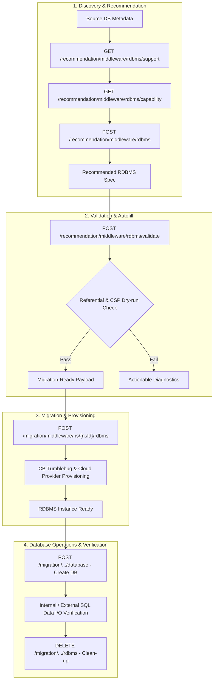

# Managed RDBMS (RDS) Feature Guide

## Overview

CM-Beetle provides end-to-end **Managed RDBMS (Relational Database Service)** recommendation, validation, and migration capabilities for heterogeneous multi-cloud environments. This feature empowers users to transition on-premises or existing cloud databases to optimal managed database services (e.g., AWS RDS, Google Cloud SQL, Azure Database, Alibaba ApsaraDB, Tencent CDB, IBM Cloud Databases, NCP Cloud DB, NHN RDS) with zero guesswork.

Key capabilities include:

- **Capability-Driven Recommendation**: Evaluates source database parameters (engine, version, vCPU, memory, storage) and maps them to the optimal target CSP DB instance spec and configuration using real-time CSP capability metrics.
- **Pre-flight & Referential Validation**: Performs multi-tier dry-run validations against CSP API rules and referential integrity (e.g., matching VNet/Subnet/SecurityGroup connection profiles) before touching cloud resources.
- **Automated Migration & Provisioning**: Seamlessly deploys managed database clusters and instances via CB-Tumblebug with robust state tracking.
- **Logical Database Lifecycle Management**: Supports creation, listing, and deletion of logical tenant databases inside the provisioned RDBMS instance.
- **Data I/O Verification**: Supports end-to-end connectivity and SQL I/O verification for both public-accessible and private-isolated database topologies.

---

## Architecture & Workflow

The Managed RDBMS workflow spans from initial capability discovery to post-migration database operations:


```mermaid
flowchart TD
    subgraph Phase1["1. Discovery & Recommendation"]
        A["Source DB Metadata"] --> B["GET /recommendation/middleware/rdbms/support"]
        B --> C["GET /recommendation/middleware/rdbms/capability"]
        C --> D["POST /recommendation/middleware/rdbms"]
        D --> E["Recommended RDBMS Spec"]
    end

    subgraph Phase2["2. Validation & Autofill"]
        E --> F["POST /recommendation/middleware/rdbms/validate"]
        F --> G{"Referential & CSP Dry-run Check"}
        G -->|Pass| H["Migration-Ready Payload"]
        G -->|Fail| I["Actionable Diagnostics"]
    end

    subgraph Phase3["3. Migration & Provisioning"]
        H --> J["POST /migration/middleware/ns/{nsId}/rdbms"]
        J --> K["CB-Tumblebug & Cloud Provider Provisioning"]
        K --> L["RDBMS Instance Ready"]
    end

    subgraph Phase4["4. Database Operations & Verification"]
        L --> M["POST /migration/.../database - Create DB"]
        M --> N["Internal / External SQL Data I/O Verification"]
        N --> O["DELETE /migration/.../rdbms - Clean-up"]
    end
```

---

## CSP Support Matrix

CM-Beetle Managed RDBMS supports multi-cloud database provisioning across 9 major Cloud Service Providers (CSPs), with dedicated verification for **MySQL** and **MariaDB**.

### 1. MySQL Support Matrix

MySQL is verified and supported across all 9 CSPs:

| CSP           | Service Brand                    | Supported Versions     |   Access Mode    | Subnet Requirement                              | Provisioning Characteristics                                              |
| :------------ | :------------------------------- | :--------------------- | :--------------: | :---------------------------------------------- | :------------------------------------------------------------------------ |
| **AWS**       | Amazon RDS for MySQL             | 8.4, 8.0, 5.7          | Public / Private | Multi-AZ Subnet Group (>= 2 subnets across AZs) | High availability and automated failover                                  |
| **Azure**     | Azure Database for MySQL         | 8.4, 8.0 (8.0.21), 5.7 | Public / Private | Single or Multi-Subnet                          | Flexible server architecture; supports 8.4 & 9.5                          |
| **GCP**       | Google Cloud SQL for MySQL       | 8.4, 8.0, 5.7          | Public / Private | Authorized Networks / VPC Peering               | Highly performant storage scaling                                         |
| **Alibaba**   | Alibaba Cloud ApsaraDB for MySQL | 8.4, 8.0, 5.7          | Public / Private | VNet Subnet Binding                             | Broad engine version choices                                              |
| **Tencent**   | Tencent Cloud CDB for MySQL      | 8.4, 8.0, 5.7, 5.6     | Public / Private | Multi-AZ VPC Subnet Group                       | Fast regional provisioning                                                |
| **IBM**       | IBM Cloud Databases for MySQL    | 8.4 (replaces 8.0)     | Public / Private | Resource Group / VPC bound                      | `multitenant` (~9-10m) vs dedicated `b3c.*` (35-45+m) hosting models      |
| **NCP**       | NAVER Cloud DB for MySQL         | 8.0 (8.0.36)           |   Private Only   | Single Subnet + Dedicated DB Port               | Private access enforced; verified via Internal Runner VM                  |
| **NHN**       | NHN Cloud RDS for MySQL          | 8.4, 8.0, 5.7          | Public / Private | Standard VPC Subnet                             | Dedicated DB Security Group required (nhnDBSGToAllowAllInbound supported) |
| **OpenStack** | OpenStack Trove (MySQL)          | 5.7.29                 | Public / Private | Standard VPC Subnet / Floating IP               | Flexible private cloud deployment; verified external & internal SQL I/O   |

### 2. MariaDB Support Matrix

MariaDB is natively supported across 4 CSPs:

| CSP           | Service Brand                      | Supported Versions            |   Access Mode    | Subnet Requirement                              | Provisioning Characteristics                      |
| :------------ | :--------------------------------- | :---------------------------- | :--------------: | :---------------------------------------------- | :------------------------------------------------ |
| **AWS**       | Amazon RDS for MariaDB             | 10.5, 10.6, 10.11, 11.4, 11.8 | Public / Private | Multi-AZ Subnet Group (>= 2 subnets across AZs) | Automated failover, parameter group customization |
| **Alibaba**   | Alibaba Cloud ApsaraDB for MariaDB | 10.6, 10.3                    | Public / Private | VNet Subnet Binding                             | High-availability primary/standby architecture    |
| **NHN**       | NHN Cloud RDS for MariaDB          | 10.6, 10.11, 11.4 (10.3~11.8) | Public / Private | Standard VPC Subnet                             | AppKey credential integration required            |
| **OpenStack** | OpenStack Trove (MariaDB)          | 10.4                          | Public / Private | Standard VPC Subnet / Floating IP               | Reference version 10.4 in RegionOne datastore     |

> [!NOTE]
> **Automatic Compatibility Fallback**:
> For CSPs that do not provide native MariaDB managed services (**Azure**, **GCP**, **Tencent**, **IBM**, **NCP**, **KT**), CM-Beetle's recommendation engine detects the absence of MariaDB support via CB-Tumblebug capability metadata and automatically recommends **MySQL** as an API-compatible fallback with actionable warnings.

---

## API Reference

### 1. Discovery & Recommendation APIs

#### 1.1 Get CSP Support Matrix

Retrieve supported database engines, features, and operation methods across all or specific CSPs.

- **Endpoint**: `GET /recommendation/middleware/rdbms/support`
- **Query Parameter**:
  - `providerName` (optional): Filter by CSP provider (e.g., `aws`, `azure`, `gcp`, `ibm`, `ncp`, `nhn`).

**Sample Request**:

```http
GET /beetle/recommendation/middleware/rdbms/support?providerName=aws HTTP/1.1
Host: localhost:8056
Authorization: Basic <credentials>
```

**Sample Response**:

```json
{
  "resourceType": "rdbms",
  "supports": {
    "aws": {
      "supported": true,
      "supportedDBEngines": ["mysql", "mariadb"],
      "dbOperationMethod": "sqlFallback",
      "supportsTag": true,
      "storageTypeSelectable": true
    }
  }
}
```

---

#### 1.2 Get Real-time Capability Options

Fetch live DB instance spec catalogs, supported engine versions, and storage configurations for a given connection.

- **Endpoint**: `GET /recommendation/middleware/rdbms/capability`
- **Query Parameter**:
  - `connectionName` (required): Target cloud connection name (e.g., `aws-ap-northeast-2`).

**Sample Response**:

```json
{
  "resourceType": "rdbms",
  "connectionName": "aws-ap-northeast-2",
  "supportedDBEngines": ["mysql", "mariadb"],
  "dbmsRequirements": {
    "mysql": {
      "referenceDBInstanceSpec": "db.t3.medium",
      "rootDiskType": "gp2",
      "rootDiskSize": "100"
    }
  },
  "dbInstanceSpecs": [
    {
      "cspSpecName": "db.t3.medium",
      "vCPU": 2,
      "memoryGiB": 4.0
    }
  ]
}
```

---

#### 1.3 Recommend Managed RDBMS

Recommends optimal target RDBMS specifications based on source database workloads and desired cloud properties.

- **Endpoint**: `POST /recommendation/middleware/rdbms`
- **Request Body**: `RecommendRDBMSRequest`

**Sample Request**:

```json
{
  "desiredCloud": {
    "csp": "aws",
    "region": "ap-northeast-2"
  },
  "autoFillSourceDefaults": true,
  "targetPreferences": {
    "adminUserName": "dbadmin",
    "highAvailability": true,
    "publicAccess": true,
    "backupRetentionDays": 7
  },
  "sourceRDBMSInstances": [
    {
      "displayName": "source-mysql-01",
      "description": "Production user database instance",
      "dbNode": {
        "hostname": "db-server-01",
        "cpu": {
          "cpus": 1,
          "cores": 4,
          "threads": 4
        },
        "memory": {
          "totalSize": 16
        },
        "rootDisk": {
          "label": "/",
          "totalSize": 50,
          "type": "SSD"
        },
        "dataDisks": [
          {
            "label": "/data",
            "totalSize": 50,
            "type": "SSD"
          }
        ]
      },
      "dbEngine": {
        "engine": "mysql",
        "engineVersion": "8.0",
        "port": 3306,
        "role": "primary"
      },
      "innerDatabases": [
        {
          "databaseName": "userdb",
          "characterSet": "utf8mb4",
          "collation": "utf8mb4_unicode_ci"
        }
      ]
    }
  ]
}
```

**Sample Response**:

```json
{
  "desiredCloud": {
    "provider": "aws",
    "region": "ap-northeast-2"
  },
  "recommendedRDBMS": [
    {
      "sourceInstanceId": "source-mysql-01",
      "dbEngine": "mysql",
      "dbEngineVersion": "8.0",
      "dbInstanceSpec": "db.m5.large",
      "storageType": "gp3",
      "storageSize": 100,
      "highAvailability": true,
      "publicAccess": true
    }
  ]
}
```

---

### 2. Validation & Autofill API

#### Validate RDBMS Recommendation

Executes pre-flight referential integrity checks and dry-run validation without provisioning cloud resources.

- **Endpoint**: `POST /recommendation/middleware/rdbms/validate`
- **Query Parameter**:
  - `nsId` (optional): Namespace identifier for referential resource checks.
- **Request Body**: `RDBMSCreateRequest`

**Validation Checks Performed**:

1. **Connection Consistency**: Verifies that the VNet, Subnet(s), and Security Group(s) belong to the same CSP connection profile as the target RDBMS.
2. **Engine & Version Compatibility**: Checks if the specified DB engine version is supported by the target CSP capability catalog.
3. **Multi-AZ Subnet Requirements**: Validates whether the CSP requires multiple subnets across distinct Availability Zones (e.g., AWS, Tencent).
4. **Access Constraint Alignment**: Adjusts and validates `publicAccess` flags for CSPs with private-only policies (e.g., NCP).

---

### 3. Migration & Management APIs

#### 3.1 Migrate (Provision) Managed RDBMS

Provisions the recommended Managed RDBMS instance in the specified namespace.

- **Endpoint**: `POST /migration/middleware/ns/{nsId}/rdbms`
- **Query Parameter**:
  - `nameSeed` (optional): Prefix seed for deterministic instance naming.

**Sample Request**:

```json
{
  "name": "prod-rdbms-mysql",
  "connectionName": "aws-ap-northeast-2",
  "vNetId": "vpc-01",
  "subnetIds": ["subnet-1a", "subnet-1c"],
  "securityGroupIds": ["sg-db-01"],
  "dbEngine": "mysql",
  "dbEngineVersion": "8.0",
  "dbInstanceSpec": "db.t3.medium",
  "storageType": "gp3",
  "storageSize": 100,
  "adminUserName": "dbadmin",
  "adminUserPassword": "SecurePassword123!",
  "publicAccess": true,
  "highAvailability": false
}
```

---

#### 3.2 Logical Database Management (CRUD)

Once the managed RDBMS is provisioned, logical tenant databases can be created, inspected, and deleted.

> [!NOTE]
> **Zero-Credential Security Policy**:
> Neither CB-Tumblebug nor CM-Beetle persists or stores database administrator credentials.
> All logical database management requests require callers to explicitly provide credentials via HTTP headers:
>
> - `X-Admin-User-Name`: Database master/administrator username
> - `X-Admin-User-Password`: Database master/administrator password

- **Create Database**: `POST /migration/middleware/ns/{nsId}/rdbms/{rdbmsId}/database`
  - **Headers**: `X-Admin-User-Name: <username>`, `X-Admin-User-Password: <password>`
  - **Body**:
    ```json
    {
      "databaseName": "customerdb"
    }
    ```
- **List Databases**: `GET /migration/middleware/ns/{nsId}/rdbms/{rdbmsId}/database`
  - **Headers**: `X-Admin-User-Name: <username>`, `X-Admin-User-Password: <password>`
- **Delete Database**: `DELETE /migration/middleware/ns/{nsId}/rdbms/{rdbmsId}/database/{databaseName}`
  - **Headers**: `X-Admin-User-Name: <username>`, `X-Admin-User-Password: <password>`

---

#### 3.3 Secure Transport & Server CA Certificate Inspection

Inspects live TLS/SSL enforcement status, active cipher suite, and server CA certificate from the cloud provider.

- **Endpoint**: `GET /migration/middleware/ns/{nsId}/rdbms/{rdbmsId}/secure-transport`
- **Headers**:
  - `X-Admin-User-Name`: Database master/administrator username
  - `X-Admin-User-Password`: Database master/administrator password
- **Sample Response**:
  ```json
  {
    "status": "SUCCESS",
    "message": "Successfully retrieved secure transport info",
    "data": {
      "engine": "mysql",
      "requireSecureTransport": "ON",
      "enforced": true,
      "rules": "REQUIRE SSL",
      "tlsInUse": true,
      "tlsCipher": "ECDHE-RSA-AES128-GCM-SHA256",
      "caCertificate": {
        "pem": "-----BEGIN CERTIFICATE-----\n...\n-----END CERTIFICATE-----",
        "subject": "CN=rds.amazonaws.com",
        "issuer": "CN=Amazon Root CA 1",
        "notAfter": "2027-10-08T00:00:00Z",
        "isSelfSigned": false
      },
      "recommendedSSLMode": "VERIFY_IDENTITY"
    }
  }
  ```

---

#### 3.4 Delete Managed RDBMS

Terminates and removes the RDBMS instance.

- **Endpoint**: `DELETE /migration/middleware/ns/{nsId}/rdbms/{rdbmsId}`
- **Query Parameter**:
  - `option=force`: Forces deletion if cloud-side instances are in an error or intermediate state.

---

## Best Practices & Operational Guidelines

1. **Pre-requisite Infrastructure Alignment**:
   - Always ensure pre-requisite Virtual Networks (`VNet`), `Subnets`, and `Security Groups` are provisioned prior to issuing the RDBMS migration request.
   - For AWS and Tencent, ensure at least **two subnets in different Availability Zones** are attached to satisfy CSP subnet group requirements.
2. **Private Network Isolation & Access Control (NCP & Enterprise Deployments)**:
   - For CSPs like NAVER Cloud Platform (NCP) that enforce private database isolation, perform validation and connectivity tests using a temporary internal Runner VM provisioned within the same VNet.
   - **NCP ACG Default Deny Policy**: NCP Cloud DB ACGs default to **0 inbound rules (Default Deny)**. Even internal traffic from a runner VM within the same VPC is blocked on port 3306 unless an inbound ACG rule is configured in NCP Console (`Database > Cloud DB for MySQL > ACG`) or `ncpDBACGToAllowAllInbound: true` is configured in the creation request (convenience option for test/dev only).
3. **Provisioning Timeouts & Asynchronous Execution**:
   - Cloud database provisioning typically takes 5 to 15 minutes across most CSPs.
   - For **IBM Cloud Databases**:
     - The **`multitenant`** hosting model provisions in approximately **9 to 10 minutes** and is recommended by default.
     - Dedicated/encrypted host flavors (e.g., **`b3c.4x16.encrypted`**) take **35 to 45+ minutes** due to dedicated bare-metal/VPC hardware slice allocation and storage encryption.
   - Ensure client and reverse-proxy timeouts are configured with at least **50 minutes** if calling synchronously with dedicated host flavors, or execute via the asynchronous API (`Prefer: respond-async`).
4. **Storage Capacity Metric Standardization**:
   - Storage size ranges and capabilities are standardized to 10-decimal Gigabytes (`storageSizeRangeGB`, $10^9$ bytes) per CB-Spider issue #1820. Validation and UI sliders should align with `storageSizeRangeGB` returned from capability APIs.
