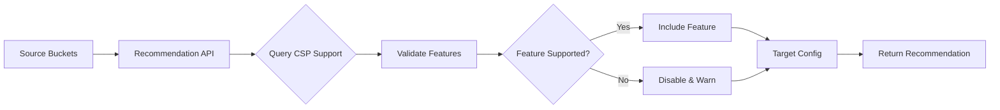
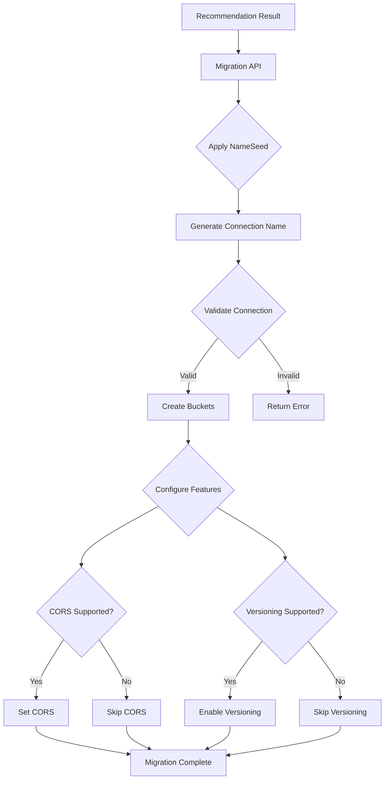
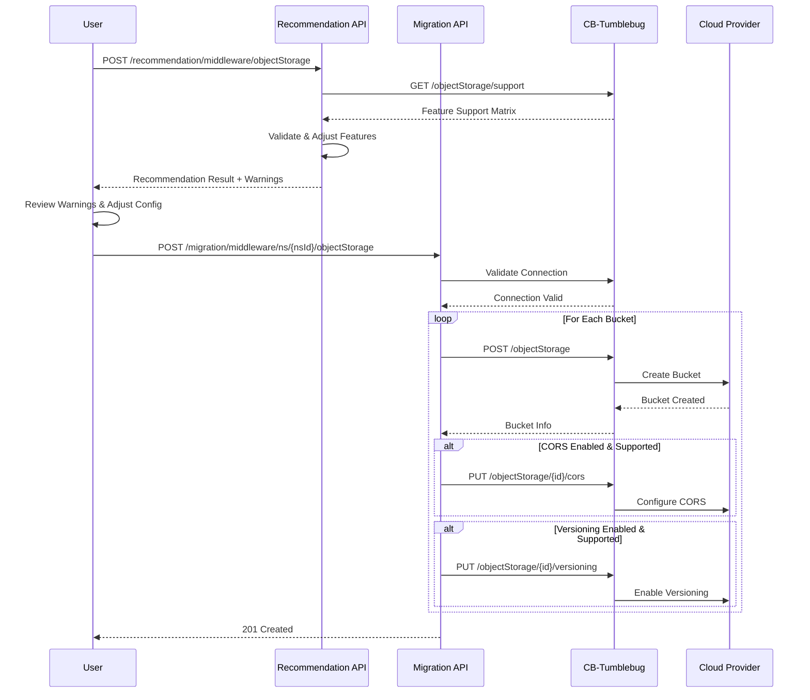
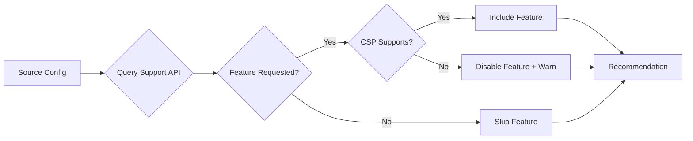
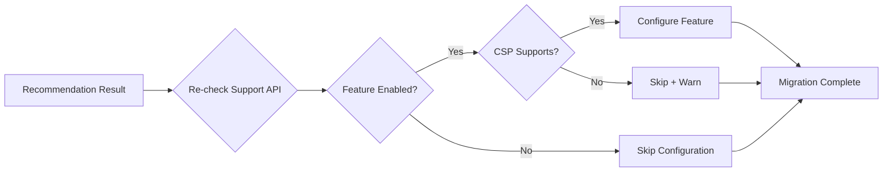

# Object Storage Feature Guide

## Overview

CM-Beetle provides intelligent Object Storage (bucket) recommendation and migration capabilities for multi-cloud environments. This feature enables you to:

- **Recommend** optimal object storage configurations for target cloud providers
- **Validate** feature compatibility across different CSPs (CORS, Versioning, Presigned URLs)
- **Migrate** object storage infrastructure with automatic feature adjustment
- **Manage** object storage resources through a unified API

The Object Storage feature integrates with CB-Tumblebug to provide CSP-aware recommendations that automatically adjust configurations based on target cloud capabilities.

---

## Object Storage Recommendation

### What It Does

The recommendation API analyzes your source object storage configurations and generates CSP-compatible target configurations. It:

1. **Validates** requested features against target CSP capabilities
2. **Adjusts** configurations when features are not supported
3. **Generates** unique bucket names with deterministic patterns
4. **Provides** warnings when features are disabled
5. **Returns** migration-ready configurations

### How It Works



**Process Flow:**

1. User submits source bucket configurations with desired target CSP/region
2. API queries CB-Tumblebug for CSP feature support information
3. For each source bucket:
   - Check if CORS is supported on target CSP
   - Check if Versioning is supported on target CSP
   - Adjust configuration if features are unavailable
   - Generate warnings for disabled features
4. Return validated configurations ready for migration

### CSP Feature Support Matrix

| CSP       | CORS | Versioning | PresignedUrl | Notes                                    |
| --------- | ---- | ---------- | ------------ | ---------------------------------------- |
| AWS       | ✅   | ✅         | ✅           | Full support                             |
| GCP       | ✅   | ✅         | ✅           | Full support                             |
| Azure     | ❌   | ❌         | ✅           | CORS/Versioning at Storage Account level |
| Alibaba   | ✅   | ✅         | ✅           | Full support                             |
| Tencent   | ✅   | ✅         | ✅           | Full support                             |
| IBM       | ✅   | ✅         | ✅           | Full support                             |
| OpenStack | ✅   | ❌         | ✅           | No Versioning support                    |
| NCP       | ❌   | ❌         | ✅           | CORS/Versioning not supported            |
| NHN       | ❌   | ❌         | ✅           | CORS/Versioning not supported            |
| KT        | ✅   | ✅         | ✅           | Full support                             |

**Note:** Azure and NCP have limited bucket-level feature support. CORS and Versioning may be available at the storage account level but are not configurable per bucket through CB-Tumblebug.

### API Reference

**Endpoint:** `POST /recommendation/middleware/objectStorage`

**Parameters:**

| Parameter     | Type   | Location | Required | Description                          |
| ------------- | ------ | -------- | -------- | ------------------------------------ |
| desiredCsp    | string | query    | No       | Target CSP (e.g., aws, azure, gcp)   |
| desiredRegion | string | query    | No       | Target region (e.g., ap-northeast-2) |
| request body  | JSON   | body     | Yes      | Source object storage configurations |

**Note:** CSP and region can be specified in query parameters OR request body. Query parameters take precedence.

**Request Body Schema:**

```json
{
  "nameSeed": "string (optional)",
  "desiredCloud": {
    "csp": "string (required if not in query)",
    "region": "string (required if not in query)"
  },
  "sourceObjectStorages": [
    {
      "bucketName": "string",
      "versioningEnabled": "boolean",
      "corsEnabled": "boolean",
      "corsRule": [
        {
          "allowedOrigin": ["string"],
          "allowedMethod": ["string"],
          "allowedHeader": ["string"],
          "exposeHeader": ["string"],
          "maxAgeSeconds": "integer"
        }
      ]
    }
  ]
}
```

**Response Schema:**

```json
{
  "success": true,
  "message": "Recommended N object storage(s) for CSP REGION",
  "data": {
    "nameSeed": "string",
    "status": "success|partial",
    "description": "string",
    "warnings": ["string"],
    "targetCloud": {
      "csp": "string",
      "region": "string"
    },
    "targetObjectStorages": [
      {
        "sourceBucketName": "string",
        "bucketName": "string",
        "versioningEnabled": "boolean",
        "corsEnabled": "boolean",
        "corsRule": [...]
      }
    ]
  }
}
```

### Request/Response Examples

#### Example 1: AWS - Full Feature Support

**Request:**

```bash
curl -X POST "http://localhost:8056/api/v1/recommendation/middleware/objectStorage?desiredCsp=aws&desiredRegion=ap-northeast-2" \
  -H "Content-Type: application/json" \
  -d '{
    "nameSeed": "myapp",
    "sourceObjectStorages": [
      {
        "bucketName": "production-data",
        "versioningEnabled": true,
        "corsEnabled": true,
        "corsRule": [
          {
            "allowedOrigin": ["https://example.com"],
            "allowedMethod": ["GET", "PUT"],
            "allowedHeader": ["*"],
            "maxAgeSeconds": 3600
          }
        ]
      }
    ]
  }'
```

**Response:**

```json
{
  "success": true,
  "message": "Recommended 1 object storage(s) for aws ap-northeast-2",
  "data": {
    "nameSeed": "myapp",
    "status": "success",
    "description": "Successfully recommended 1 object storage configuration(s)",
    "warnings": [],
    "targetCloud": {
      "csp": "aws",
      "region": "ap-northeast-2"
    },
    "targetObjectStorages": [
      {
        "sourceBucketName": "production-data",
        "bucketName": "os-01",
        "versioningEnabled": true,
        "corsEnabled": true,
        "corsRule": [
          {
            "allowedOrigin": ["https://example.com"],
            "allowedMethod": ["GET", "PUT"],
            "allowedHeader": ["*"],
            "maxAgeSeconds": 3600
          }
        ]
      }
    ]
  }
}
```

**Note:** With `nameSeed: "myapp"`, the final bucket name becomes `myapp-os-01` during migration (Late Binding).

#### Example 2: Azure - Limited Feature Support

**Request:**

```bash
curl -X POST "http://localhost:8056/api/v1/recommendation/middleware/objectStorage" \
  -H "Content-Type: application/json" \
  -d '{
    "desiredCloud": {
      "csp": "azure",
      "region": "eastus"
    },
    "sourceObjectStorages": [
      {
        "bucketName": "user-uploads",
        "versioningEnabled": true,
        "corsEnabled": true,
        "corsRule": [
          {
            "allowedOrigin": ["*"],
            "allowedMethod": ["GET", "POST"],
            "maxAgeSeconds": 7200
          }
        ]
      }
    ]
  }'
```

**Response:**

```json
{
  "success": true,
  "message": "Recommended 1 object storage(s) for azure eastus",
  "data": {
    "status": "partial",
    "description": "Successfully recommended 1 object storage configuration(s)",
    "warnings": [
      "Bucket 'user-uploads': versioning disabled (not supported on azure)",
      "Bucket 'user-uploads': CORS disabled (not supported on azure)"
    ],
    "targetCloud": {
      "csp": "azure",
      "region": "eastus"
    },
    "targetObjectStorages": [
      {
        "sourceBucketName": "user-uploads",
        "bucketName": "os-01",
        "versioningEnabled": false,
        "corsEnabled": false,
        "corsRule": null
      }
    ]
  }
}
```

**Key Differences:**

- `status: "partial"` indicates feature adjustments
- `warnings` array contains specific messages about disabled features
- `versioningEnabled` and `corsEnabled` automatically set to `false`
- `corsRule` set to `null`

### Feature Validation and Adjustment

The recommendation API automatically validates and adjusts features:

#### CORS (Cross-Origin Resource Sharing)

**Supported CSPs:** AWS, GCP, Alibaba, Tencent, IBM, OpenStack, KT

**Behavior:**

- If source has CORS enabled and target CSP supports CORS → Include CORS configuration
- If source has CORS enabled but target CSP does not support CORS → Disable CORS, add warning
- CORS rules are preserved when supported

**Warning Example:**

```
"Bucket 'my-bucket': CORS disabled (not supported on azure)"
```

#### Versioning

**Supported CSPs:** AWS, GCP, Alibaba, Tencent, IBM, KT

**Behavior:**

- If source has versioning enabled and target CSP supports versioning → Enable versioning
- If source has versioning enabled but target CSP does not support versioning → Disable versioning, add warning

**Warning Example:**

```
"Bucket 'my-bucket': versioning disabled (not supported on openstack)"
```

#### Presigned URLs

**Supported CSPs:** All CSPs (AWS, GCP, Azure, Alibaba, Tencent, IBM, OpenStack, NCP, NHN, KT)

**Behavior:**

- Presigned URLs are supported across all CSPs
- No validation or adjustment required

### Best Practices

1. **Always check warnings in the response**
   - Warnings indicate features that were disabled
   - Plan alternative solutions for disabled features (e.g., application-level CORS)

2. **Use query parameters for quick tests**
   - Query parameters: `?desiredCsp=aws&desiredRegion=us-east-1`
   - Request body: Better for complex configurations

3. **Leverage nameSeed for multi-environment deployments**
   - Set `nameSeed` to environment prefix (e.g., `dev`, `staging`, `prod`)
   - Final bucket names: `dev-os-01`, `staging-os-01`, `prod-os-01`

4. **Review CSP feature matrix before migration**
   - Check if target CSP supports required features
   - Consider alternative CSPs if critical features are missing

5. **Save recommendation results**
   - Use the recommendation output directly as migration input
   - Store for audit trails and rollback planning

---

## Object Storage Migration

### What It Does

The migration API creates object storage buckets in the target cloud based on recommendation results. It:

1. **Creates** buckets in the target CSP/region
2. **Configures** CORS rules (if supported by CSP)
3. **Enables** versioning (if supported by CSP)
4. **Applies** nameSeed prefix (Late Binding)
5. **Validates** CSP connection configuration

### How It Works



**Process Flow:**

1. User submits recommendation result to migration API
2. API applies `nameSeed` prefix to bucket names (Late Binding)
3. API generates connection name from CSP + region
4. API validates connection configuration exists in CB-Tumblebug
5. For each target bucket:
   - Create bucket via CB-Tumblebug
   - Configure CORS if enabled and supported
   - Enable versioning if enabled and supported
6. Return success or detailed error

### API Reference

**Endpoint:** `POST /migration/middleware/ns/{nsId}/objectStorage`

**Parameters:**

| Parameter | Type   | Location | Required | Description                                      |
| --------- | ------ | -------- | -------- | ------------------------------------------------ |
| nsId      | string | path     | Yes      | Namespace ID (e.g., mig01)                       |
| request   | JSON   | body     | Yes      | Recommendation result (RecommendedObjectStorage) |

**Request Body Schema:**

```json
{
  "nameSeed": "string (optional)",
  "targetCloud": {
    "csp": "string (required)",
    "region": "string (required)"
  },
  "targetObjectStorages": [
    {
      "sourceBucketName": "string",
      "bucketName": "string (required)",
      "versioningEnabled": "boolean",
      "corsEnabled": "boolean",
      "corsRule": [
        {
          "allowedOrigin": ["string"],
          "allowedMethod": ["string"],
          "allowedHeader": ["string"],
          "exposeHeader": ["string"],
          "maxAgeSeconds": "integer"
        }
      ]
    }
  ]
}
```

**Response:**

- **Success:** `201 Created` (no body)
- **Error:** JSON with error details

### Request/Response Examples

#### Example 1: Basic Migration (AWS)

**Request:**

```bash
curl -X POST "http://localhost:8056/api/v1/migration/middleware/ns/mig01/objectStorage" \
  -H "Content-Type: application/json" \
  -d '{
    "nameSeed": "prod",
    "targetCloud": {
      "csp": "aws",
      "region": "ap-northeast-2"
    },
    "targetObjectStorages": [
      {
        "sourceBucketName": "production-data",
        "bucketName": "os-01",
        "versioningEnabled": true,
        "corsEnabled": true,
        "corsRule": [
          {
            "allowedOrigin": ["https://example.com"],
            "allowedMethod": ["GET", "PUT"],
            "allowedHeader": ["*"],
            "maxAgeSeconds": 3600
          }
        ]
      },
      {
        "sourceBucketName": "backup-data",
        "bucketName": "os-02",
        "versioningEnabled": true,
        "corsEnabled": false
      }
    ]
  }'
```

**Response:**

```
HTTP/1.1 201 Created
```

**Created Resources:**

- Bucket: `prod-os-01` (with CORS and versioning)
- Bucket: `prod-os-02` (with versioning only)

**Logs (example):**

```
INFO Creating object storage index=1 total=2 sourceBucket=production-data targetBucket=prod-os-01
INFO Successfully created object storage sourceBucket=production-data targetBucket=prod-os-01
INFO Versioning enabled bucket=prod-os-01
INFO CORS configured bucket=prod-os-01
INFO Creating object storage index=2 total=2 sourceBucket=backup-data targetBucket=prod-os-02
INFO Successfully created object storage sourceBucket=backup-data targetBucket=prod-os-02
INFO Versioning enabled bucket=prod-os-02
INFO Object storage migration completed successfully csp=aws region=ap-northeast-2 totalBuckets=2
```

#### Example 2: Migration with Feature Skipping (Azure)

**Request:**

```bash
curl -X POST "http://localhost:8056/api/v1/migration/middleware/ns/mig01/objectStorage" \
  -H "Content-Type: application/json" \
  -d '{
    "targetCloud": {
      "csp": "azure",
      "region": "eastus"
    },
    "targetObjectStorages": [
      {
        "sourceBucketName": "user-uploads",
        "bucketName": "os-01",
        "versioningEnabled": false,
        "corsEnabled": false
      }
    ]
  }'
```

**Response:**

```
HTTP/1.1 201 Created
```

**Created Resources:**

- Bucket: `os-01` (no CORS or versioning)

**Logs (example):**

```
INFO Creating object storage index=1 total=1 sourceBucket=user-uploads targetBucket=os-01
INFO Successfully created object storage sourceBucket=user-uploads targetBucket=os-01
WARN Versioning requested but not supported by CSP; skipping bucket=os-01 csp=azure
WARN CORS requested but not supported by CSP; skipping bucket=os-01 csp=azure
INFO Object storage migration completed successfully csp=azure region=eastus totalBuckets=1
```

#### Example 3: Error - Invalid Connection

**Request:**

```bash
curl -X POST "http://localhost:8056/api/v1/migration/middleware/ns/mig01/objectStorage" \
  -H "Content-Type: application/json" \
  -d '{
    "targetCloud": {
      "csp": "aws",
      "region": "invalid-region"
    },
    "targetObjectStorages": [
      {
        "bucketName": "os-01"
      }
    ]
  }'
```

**Response:**

```json
{
  "success": false,
  "message": "Invalid cloud configuration: aws invalid-region"
}
```

### Migration Workflow

The recommended workflow for object storage migration:



**Step-by-Step Guide:**

1. **Get Recommendation**

   ```bash
   curl -X POST "http://localhost:8056/api/v1/recommendation/middleware/objectStorage?desiredCsp=aws&desiredRegion=us-east-1" \
     -H "Content-Type: application/json" \
     -d '{...}' > recommendation.json
   ```

2. **Review Recommendation**
   - Check `warnings` array for disabled features
   - Review `targetObjectStorages` configurations
   - Adjust `nameSeed` if needed

3. **Execute Migration**

   ```bash
   curl -X POST "http://localhost:8056/api/v1/migration/middleware/ns/mig01/objectStorage" \
     -H "Content-Type: application/json" \
     -d @recommendation.json
   ```

4. **Verify Migration**
   ```bash
   curl "http://localhost:8056/api/v1/migration/middleware/ns/mig01/objectStorage"
   ```

### Feature Configuration

The migration API configures features based on CSP support:

#### CORS Configuration

**When:** `corsEnabled: true` and CSP supports CORS

**API Call:** `PUT /ns/{nsId}/objectStorage/{osId}/cors`

**Behavior:**

- Converts CORS rules to CB-Tumblebug format
- Sets CORS configuration on created bucket
- Logs success or failure

**Example:**

```json
{
  "corsRule": [
    {
      "allowedOrigin": ["https://example.com"],
      "allowedMethod": ["GET", "PUT"],
      "allowedHeader": ["*"],
      "exposeHeader": ["ETag"],
      "maxAgeSeconds": 3600
    }
  ]
}
```

#### Versioning Configuration

**When:** `versioningEnabled: true` and CSP supports versioning

**API Call:** `PUT /ns/{nsId}/objectStorage/{osId}/versioning`

**Behavior:**

- Enables versioning on created bucket
- Logs success or failure

**Example:**

```json
{
  "status": "Enabled"
}
```

#### Feature Skipping Logic

```go
// The migration API re-checks CSP support before configuring features
// This prevents errors if user modifies recommendation result

if corsEnabled {
    if !cspSupport.Cors {
        log.Warn("CORS requested but not supported; skipping")
    } else {
        // Configure CORS
    }
}

if versioningEnabled {
    if !cspSupport.Versioning {
        log.Warn("Versioning requested but not supported; skipping")
    } else {
        // Enable versioning
    }
}
```

### Best Practices

1. **Always use recommendation output as migration input**
   - Recommendation API validates features
   - Direct migration input may fail with unsupported features

2. **Review logs for feature configuration results**
   - Check for warnings about skipped features
   - Verify successful CORS/versioning configuration

3. **Test with small batches first**
   - Start with 1-2 buckets
   - Verify creation and feature configuration
   - Scale up after validation

4. **Use nameSeed for environment isolation**
   - Development: `nameSeed: "dev"`
   - Staging: `nameSeed: "staging"`
   - Production: `nameSeed: "prod"`

5. **Handle migration errors gracefully**
   - If one bucket fails, migration stops
   - Check created buckets manually
   - Re-run migration with adjusted configuration

6. **Verify bucket naming**
   - CB-Tumblebug adds a UID to bucket names for global uniqueness
   - The `bucketName` field represents the logical name, not the actual cloud resource name
   - Use CB-Tumblebug's List/Get APIs to retrieve actual bucket names

---

## Advanced Features

### Late Binding with NameSeed

**Late Binding** allows you to apply a naming prefix at migration time rather than recommendation time.

**Benefits:**

- Single recommendation for multiple environments
- Dynamic naming based on deployment context
- Consistent naming patterns across teams

**How It Works:**

1. **Recommendation Phase:**

   ```json
   {
     "nameSeed": "myapp",
     "targetObjectStorages": [
       { "bucketName": "os-01" },
       { "bucketName": "os-02" }
     ]
   }
   ```

2. **Migration Phase:**
   ```json
   {
     "nameSeed": "prod",
     "targetObjectStorages": [
       { "bucketName": "os-01" }, // Becomes: prod-os-01
       { "bucketName": "os-02" } // Becomes: prod-os-02
     ]
   }
   ```

**Use Cases:**

- **Multi-Environment Deployments:**

  ```bash
  # Dev environment
  curl ... -d '{"nameSeed": "dev", ...}'
  # Result: dev-os-01, dev-os-02

  # Staging environment
  curl ... -d '{"nameSeed": "staging", ...}'
  # Result: staging-os-01, staging-os-02

  # Production environment
  curl ... -d '{"nameSeed": "prod", ...}'
  # Result: prod-os-01, prod-os-02
  ```

- **Team-Based Isolation:**

  ```bash
  # Team A
  curl ... -d '{"nameSeed": "team-a", ...}'
  # Result: team-a-os-01

  # Team B
  curl ... -d '{"nameSeed": "team-b", ...}'
  # Result: team-b-os-01
  ```

**Naming Pattern:**

```
nameSeed-bucketName
├── Empty nameSeed: "os-01"
├── With nameSeed "myapp": "myapp-os-01"
└── With nameSeed "prod": "prod-os-01"
```

### Feature Support Validation

The system performs two-phase validation:

#### Phase 1: Recommendation Time



**Purpose:** Provide users with accurate, migration-ready configurations

**Behavior:**

- Queries CB-Tumblebug's `/objectStorage/support` API
- Validates each feature (CORS, Versioning) against CSP capabilities
- Adjusts configuration automatically
- Generates warnings for disabled features

#### Phase 2: Migration Time



**Purpose:** Prevent errors if user modifies recommendation result

**Behavior:**

- Re-validates CSP support before configuring features
- Skips unsupported features with warnings
- Continues migration even if feature configuration fails

**Why Two Phases?**

1. **Recommendation:** Guides users to valid configurations
2. **Migration:** Defends against manual modifications or CSP changes

### Warning System

The warning system provides actionable feedback when features are adjusted:

#### Warning Structure

```json
{
  "warnings": ["Bucket 'source-name': feature disabled (reason)"]
}
```

#### Warning Types

| Warning             | CSP                        | Reason                        | Action                                                   |
| ------------------- | -------------------------- | ----------------------------- | -------------------------------------------------------- |
| CORS disabled       | Azure, NCP, NHN            | Not supported at bucket level | Use storage account-level CORS or application-level CORS |
| Versioning disabled | OpenStack, NCP, NHN, Azure | Not supported                 | Use application-level versioning or object metadata      |

#### Example Warnings

**Azure:**

```json
{
  "warnings": [
    "Bucket 'user-uploads': versioning disabled (not supported on azure)",
    "Bucket 'user-uploads': CORS disabled (not supported on azure)"
  ]
}
```

**OpenStack:**

```json
{
  "warnings": [
    "Bucket 'backup-data': versioning disabled (not supported on openstack)"
  ]
}
```

#### Using Warnings

**In Automation:**

```bash
# Check for warnings
WARNINGS=$(curl ... | jq '.data.warnings | length')
if [ "$WARNINGS" -gt 0 ]; then
  echo "Warning: Features were adjusted"
  # Send alert, log warning, etc.
fi
```

**In CI/CD:**

```yaml
- name: Check Recommendation
  run: |
    RESPONSE=$(curl ...)
    STATUS=$(echo $RESPONSE | jq -r '.data.status')
    if [ "$STATUS" == "partial" ]; then
      echo "::warning::Features were adjusted. Review warnings."
    fi
```

---

## Object Storage Management APIs

CM-Beetle provides unified APIs for managing object storage resources:

### List Object Storages

**Endpoint:** `GET /migration/middleware/ns/{nsId}/objectStorage`

**Description:** List all object storages (buckets) in the namespace

**Response:**

```json
{
  "success": true,
  "data": {
    "objectStorage": [
      {
        "id": "os-01",
        "name": "prod-os-01",
        "connectionName": "aws-ap-northeast-2",
        "status": "Active",
        ...
      }
    ]
  }
}
```

### Get Object Storage Details

**Endpoint:** `GET /migration/middleware/ns/{nsId}/objectStorage/{osId}`

**Description:** Get detailed information about a specific bucket

**Response:**

```json
{
  "success": true,
  "data": {
    "id": "os-01",
    "name": "prod-os-01",
    "connectionName": "aws-ap-northeast-2",
    "status": "Active",
    "createdTime": "2024-01-15T10:30:00Z",
    ...
  }
}
```

### Check Object Storage Existence

**Endpoint:** `HEAD /migration/middleware/ns/{nsId}/objectStorage/{osId}`

**Description:** Check if a bucket exists

**Response:**

- `200 OK` - Bucket exists
- `404 Not Found` - Bucket does not exist

### Delete Object Storage

**Endpoint:** `DELETE /migration/middleware/ns/{nsId}/objectStorage/{osId}`

**Description:** Delete a specific bucket

**Response:**

- `204 No Content` - Successfully deleted
- `404 Not Found` - Bucket does not exist
- `500 Internal Server Error` - Deletion failed

---

## Troubleshooting

### Issue: Feature Not Configured After Migration

**Symptoms:**

- Bucket created successfully
- CORS or versioning not configured
- No errors in response

**Causes:**

1. CSP does not support the feature
2. Feature was disabled in recommendation
3. Feature configuration failed silently

**Solution:**

```bash
# Check recommendation warnings
curl .../recommendation/... | jq '.data.warnings'

# Check migration logs
docker logs cm-beetle | grep "bucket=your-bucket-name"

# Manually verify in cloud console
# - AWS S3: Check bucket properties
# - Azure: Check storage account settings
```

### Issue: Bucket Name Conflicts

**Symptoms:**

```json
{
  "success": false,
  "message": "Failed to create object storage 'os-01'"
}
```

**Causes:**

- Bucket name already exists in target CSP (global namespace)
- CB-Tumblebug's UID generation failed

**Solution:**

```bash
# Use different nameSeed
curl ... -d '{"nameSeed": "unique-prefix", ...}'

# Check existing buckets
curl .../migration/middleware/ns/{nsId}/objectStorage

# Delete conflicting buckets if needed
curl -X DELETE .../migration/middleware/ns/{nsId}/objectStorage/{osId}
```

### Issue: Invalid Connection Configuration

**Symptoms:**

```json
{
  "success": false,
  "message": "Invalid cloud configuration: aws invalid-region"
}
```

**Causes:**

- Connection name does not exist in CB-Tumblebug
- CSP or region name is incorrect

**Solution:**

```bash
# List available connections in CB-Tumblebug
curl http://localhost:1323/tumblebug/connConfig

# Check valid CSP/region combinations
curl http://localhost:1323/tumblebug/cloudInfo

# Create missing connection
curl -X POST http://localhost:1323/tumblebug/connConfig \
  -d '{"configName": "aws-us-east-1", ...}'
```

### Issue: Migration Stops After First Bucket Failure

**Symptoms:**

- First bucket created successfully
- Second bucket creation fails
- Migration stops

**Causes:**

- Current implementation stops on first error
- Partial migration state

**Solution:**

```bash
# List created buckets
curl .../migration/middleware/ns/{nsId}/objectStorage

# Delete failed migration
for osId in $(curl ... | jq -r '.data.objectStorage[].id'); do
  curl -X DELETE .../migration/middleware/ns/{nsId}/objectStorage/$osId
done

# Fix issue and retry migration
curl -X POST .../migration/middleware/ns/{nsId}/objectStorage \
  -d @fixed-config.json
```

---

## References

### API Documentation

- **Swagger UI:** `http://localhost:8056/api/v1/swagger/index.html`
- **Swagger YAML:** `api/swagger.yaml`
- **CB-Tumblebug API:** `http://localhost:1323/tumblebug/swagger`

### Source Code

- **Recommendation Controller:** [pkg/api/rest/controller/recommendation-object-storage.go](../pkg/api/rest/controller/recommendation-object-storage.go)
- **Migration Controller:** [pkg/api/rest/controller/migration-object-storage.go](../pkg/api/rest/controller/migration-object-storage.go)
- **Tumblebug Client:** [pkg/client/tumblebug/object-storage.go](../pkg/client/tumblebug/object-storage.go)
- **Storage Models:** [imdl/storage-model/](../imdl/storage-model/)

### Related Documentation

- [API Development Guide](api-development-guide.md)
- [Object Storage Test Results](test-results-object-storage.md)
- [Data Migration Test Results](test-results-data-migration.md)
- [Installation and Execution](installation-and-execution.md)

### CB-Tumblebug Integration

- **Object Storage Support API:** `/objectStorage/support`
- **Create Bucket API:** `/ns/{nsId}/objectStorage`
- **Configure CORS API:** `/ns/{nsId}/objectStorage/{osId}/cors`
- **Configure Versioning API:** `/ns/{nsId}/objectStorage/{osId}/versioning`

### External Resources

- [AWS S3 CORS Configuration](https://docs.aws.amazon.com/AmazonS3/latest/userguide/cors.html)
- [AWS S3 Versioning](https://docs.aws.amazon.com/AmazonS3/latest/userguide/Versioning.html)
- [Azure Blob Storage CORS](https://docs.microsoft.com/azure/storage/blobs/storage-cors-support)
- [GCP Cloud Storage CORS](https://cloud.google.com/storage/docs/cross-origin)
