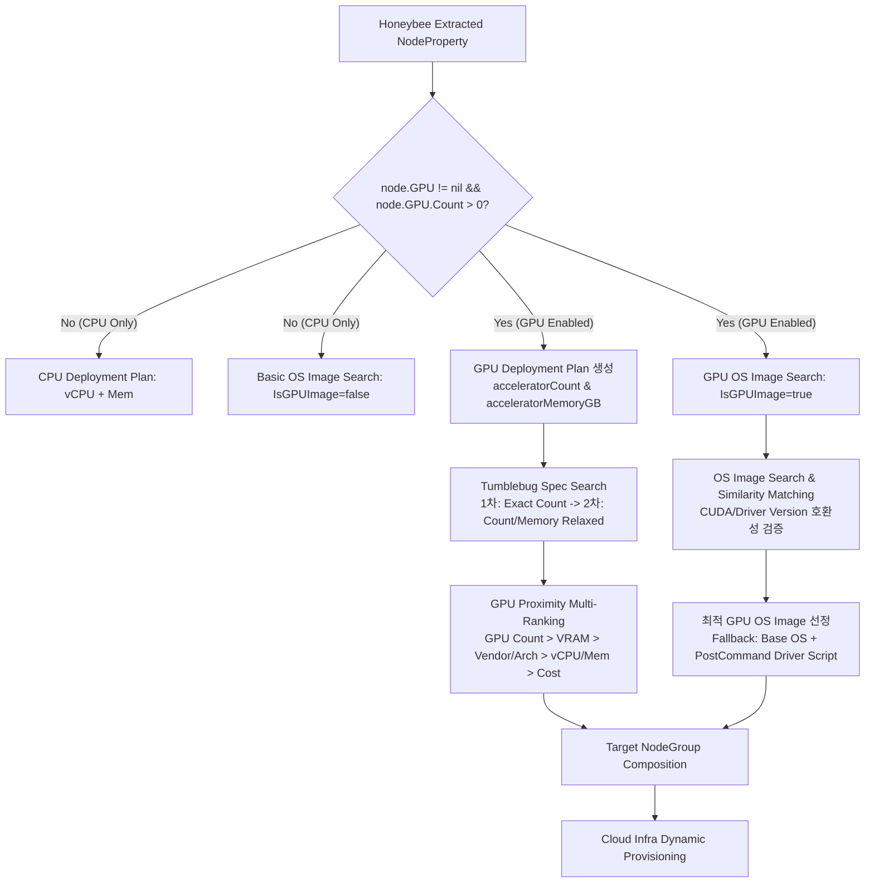

# GPU Support Plan for Recommendation and Migration

> **Status**: Approved & In Progress (Phase 1 Completed)  
> **Author**: Cloud-Barista CM-Beetle Development Team  
> **Created**: 2026-09-02  
> **Target Components**: `imdl/on-premise-model`, `pkg/core/recommendation`, `pkg/compat`, `ui`

---

## 1. 개요 및 배경 (Overview & Background)

AI/ML, 대규모 언어 모델(LLM), 딥러닝 학습/추론, HPC(고성능 컴퓨팅), 미디어 트랜스코딩 등 고성능 가속기(GPU/Accelerator) 기반 워크로드가 엔터프라이즈 인프라의 핵심으로 자리잡고 있습니다.

온프레미스 인프라를 멀티 퍼블릭 클라우드(AWS, Azure, GCP, NCP, NHN Cloud 등)로 마이그레이션할 때, **소스 서버에 탑재된 GPU 가속기 자원의 사양(수량, VRAM, CUDA 버전, 아키텍처)을 정밀하게 추출하고, 타겟 클라우드의 최적 GPU 인스턴스 스펙 및 드라이버 호환 OS 이미지를 추천/프로비저닝하는 파이프라인**이 필수적입니다.

본 문서는 CM-Beetle에서 온프레미스 인프라 모델의 GPU 프로퍼티를 체계화하고, CB-Tumblebug/CB-Spider 및 주요 CSP 가속기 모델과 연계하여 지능형 스펙/이미지 추천 및 자동 프로비저닝을 실현하기 위한 종합 설계 계획을 정의합니다.

---

## 2. 도메인 및 프로퍼티 비교 분석 (Domain Analysis)

### 2.1 CB-Tumblebug & CB-Spider 가속기 모델
CB-Tumblebug은 멀티 클라우드 가상머신 스펙 카탈로그에서 가속기를 다음과 같이 추상화하여 관리합니다:

| TB 모델 (`SpecInfo` / `SpecSummary`) | 타입 | 대표 예시 | 설명 |
| :--- | :--- | :--- | :--- |
| `acceleratorType` | `string` | `"GPU"`, `"NPU"`, `"TPU"` | 가속기 유형 구분 |
| `acceleratorModel` | `string` | `"NVIDIA A100-SXM4-80GB"`, `"Tesla T4"` | CSP가 제공하는 가속기 칩셋 모델명 |
| `acceleratorCount` | `uint8` | `1`, `2`, `4`, `8` | 인스턴스에 장착된 가속기 칩/장치 수 |
| `acceleratorMemoryGB` | `float32` | `16.0`, `24.0`, `40.0`, `80.0` | 가속기 메모리 크기 (VRAM GB) |
| `isGPUImage` / `isBasicGpuImage` (`ImageInfo`) | `bool` | `true`, `false` | GPU 드라이버 및 런타임 탑재 여부 |

### 2.2 온프레미스 / 서버 하드웨어 GPU 텔레메트리
온프레미스 물리/가상 서버에서 `nvidia-smi`, `NVML`, `GPUtil`, `lspci`, `rocm-smi`를 통해 추출 가능한 원천 데이터:

| On-Premise 소스 항목 | 타입 | 대표 예시 | 용도 |
| :--- | :--- | :--- | :--- |
| **GPU 수량 (`Count`)** | `uint32` | `1`, `2`, `4`, `8` | 독립 연산 장치(Chip/Die) 수 |
| **제조사 (`Vendor`)** | `string` | `"NVIDIA"`, `"AMD"`, `"Intel"` | 칩셋 제조사 식별 |
| **대표 모델명 (`Model`)** | `string` | `"NVIDIA A100-PCIE-40GB"`, `"Tesla T4"` | 주 가속기 모델 식별 |
| **총 VRAM (`TotalMemoryGB`)** | `float32` | `24.0`, `40.0`, `80.0` | 전체/단일 VRAM 용량 (GB) |
| **드라이버 버전 (`DriverVersion`)** | `string` | `"535.129.03"`, `"550.54.14"` | 설치된 GPU 드라이버 버전 |
| **CUDA 버전 (`CudaVersion`)** | `string` | `"12.2"`, `"12.4"` | 지원/설치된 CUDA API 버전 |
| **마이크로아키텍처 (`Architecture`)** | `string` | `"Ampere"`, `"Hopper"`, `"Ada Lovelace"` | 아키텍처 및 세대 호환성 |
| **디바이스 상세 (`Details`)** | `[]GpuDetail`| `Index`, `Uuid`, `PciBusId`, `MemoryUsed` | 실시간 사용량 및 감사 인벤토리 |

### 2.3 주요 CSP별 대표 GPU 인스턴스 패턴

| CSP | 주요 인스턴스 패밀리 | 가속기 구성 (Count × Model & VRAM) | 주 적용 워크로드 |
| :--- | :--- | :--- | :--- |
| **AWS** | `g4dn`, `g5`, `g6`<br>`p4d`, `p5`<br>`inf2`, `trn1` | 1~8× NVIDIA T4 (16GB), A10G (24GB), L4 (24GB)<br>8× NVIDIA A100 (40/80GB), H100 (80GB)<br>AWS Inferentia2, Trainium (전용 NPU) | AI 추론, 그래픽 렌더링<br>초대형 모델 학습/추론<br>전용 가속 워크로드 |
| **Azure** | `NCas_T4_v3`, `NVads_A10_v5`<br>`ND_A100_v4`, `ND_H100_v5` | 1~4× NVIDIA T4 (16GB), A10 (24GB)<br>8× NVIDIA A100 (80GB), H100 (80GB) | 머신러닝 추론, VDI<br>초고성능 분산 딥러닝 |
| **GCP** | `g2-standard-*`<br>`a2-highgpu-*`, `a3-highgpu-*`<br>`v5e`, `v5p` | 1~8× NVIDIA L4 (24GB)<br>1~16× NVIDIA A100 (40/80GB), 8× H100 (80GB)<br>Google Cloud TPU | 경량 AI 및 비디오 처리<br>LLM 분산 학습/추론<br>TPU 가속 워크로드 |
| **NCP** | `g2` 시리즈 | 1~4× NVIDIA V100 (32GB), T4 (16GB) | 엔터프라이즈 AI/HPC |


### 2.4 동일 모델명 간 스펙 편차 및 매칭 주의점 (Model Identity vs. Spec Divergence)

CPU의 경우 vCPU 코어 수와 메모리 크기(GiB)라는 표준 메트릭으로 직관적 비교가 가능하지만, **GPU는 동일한 칩셋/모델명을 공유하더라도 실제 물리 스펙과 성능이 크게 상이할 수 있습니다:**

1. **VRAM 용량 편차**:
   * 동일한 `NVIDIA A100`이라도 **40GB** 버전과 **80GB** 버전이 완전히 분리되어 제공됩니다. (Tesla V100 역시 16GB / 32GB 존재).
   * 소스가 A100 80GB를 요구하는 LLM 워크로드인 경우, 단순 모델명만 보고 40GB 버전을 매칭하면 OOM(Out of Memory)으로 서비스 구동이 불가능합니다.
2. **가상화 슬라이스 (vGPU / MIG 파티셔닝)**:
   * 온프레미스에서는 물리 GPU 전체(Full Chip)를 할당받아 쓰거나 MIG로 세분화하여 사용합니다.
   * 클라우드에서도 단일 물리 GPU를 슬라이스로 쪼갠 인스턴스를 제공합니다. (예: Azure `NVads A10 v5` 시리즈는 동일한 `NVIDIA A10` 명칭이지만 인스턴스 크기에 따라 4GB(1/6), 8GB(1/3), 12GB(1/2), 24GB(전체) VRAM으로 나뉨).
3. **폼팩터 및 인터커넥트 대역폭 (PCIe vs SXM/NVLink)**:
   * PCIe 버전(대역폭 ~64GB/s)과 SXM/NVLink 버전(대역폭 600~900GB/s)은 대규모 분산 딥러닝 훈련 속도에서 수 배의 차이를 보입니다.
4. **CSP 커스텀 파생 칩셋**:
   * 예: AWS 전용 `NVIDIA A10G`는 표준 엔터프라이즈 `A10`과 클럭, 인코더 구성 및 TDP가 상이합니다.

> **설계 원칙**: 따라서 단순 텍스트 기반 모델명 일치에 의존하지 않고, **`acceleratorCount`**(가속기 수량)와 **`acceleratorMemoryGB`**(개별 VRAM 크기)를 1차 정량 메트릭 필터로 삼고, 모델명 및 아키텍처는 친화도(Affinity) 가중치로 평가해야 합니다.

---

## 3. 인프라 모델 스키마 정의 (Schema Design)

### 3.1 Go 구조체 ([imdl/on-premise-model/node.go](file:///home/ubuntu/dev/cloud-barista/cm-beetle/imdl/on-premise-model/node.go))

```go
package onpremisemodel

// NodeProperty represents a node in the on-premise infrastructure.
type NodeProperty struct {
	Hostname      string                     `json:"hostname"`
	MachineId     string                     `json:"machineId"`                              // Unique identifier for the node (e.g., UUID)
	Role          string                     `json:"role,omitempty" example:"control-plane"` // Node role (e.g., "control-plane", "worker", "standalone")
	CPU           CpuProperty                `json:"cpu"`
	Memory        MemoryProperty             `json:"memory"`
	RootDisk      DiskProperty               `json:"rootDisk"`
	DataDisks     []DiskProperty             `json:"dataDisks,omitempty"`
	Interfaces    []NetworkInterfaceProperty `json:"interfaces"`
	RoutingTable  []RouteProperty            `json:"routingTable"`
	FirewallTable []FirewallRuleProperty     `json:"firewallTable,omitempty"`
	OS            OsProperty                 `json:"os"`
	GPU           *GpuProperty               `json:"gpu,omitempty"`                          // GPU accelerator hardware information (optional)
}

// GpuProperty represents GPU and accelerator hardware information of an on-premise node.
type GpuProperty struct {
	Count         uint32      `json:"count" validate:"required" example:"1"`           // Number of physical GPU devices/chips
	Vendor        string      `json:"vendor,omitempty" example:"NVIDIA"`               // GPU Vendor/Manufacturer (e.g., "NVIDIA", "AMD", "Intel")
	Model         string      `json:"model,omitempty" example:"NVIDIA A100-PCIE-40GB"` // Primary GPU model name (e.g., "Tesla T4", "NVIDIA A100-PCIE-40GB", "GeForce RTX 4090")
	Type          string      `json:"type,omitempty" example:"GPU"`                    // Accelerator type: "GPU", "NPU", "TPU" (defaults to "GPU")
	TotalMemoryGB float32     `json:"totalMemoryGB,omitempty" example:"40"`            // Total VRAM across all devices in GB
	DriverVersion string      `json:"driverVersion,omitempty" example:"535.129.03"`    // Installed GPU driver version
	CudaVersion   string      `json:"cudaVersion,omitempty" example:"12.2"`            // Supported/Installed CUDA version (e.g., "12.2", "12.4")
	Architecture  string      `json:"architecture,omitempty" example:"Ampere"`         // GPU Microarchitecture (e.g., "Ampere", "Hopper", "Ada Lovelace", "Turing", "Volta")
	Details       []GpuDetail `json:"details,omitempty"`                               // Detailed information per individual physical GPU device
}

// GpuDetail represents detailed hardware attributes of an individual physical GPU device.
type GpuDetail struct {
	Index       uint32  `json:"index" example:"0"`                                         // Device index (e.g., 0, 1)
	Uuid        string  `json:"uuid,omitempty" example:"GPU-12345678-abcd-ef01-2345-..."`  // Unique device UUID from driver (e.g., NVML GPU UUID)
	Model       string  `json:"model,omitempty" example:"NVIDIA A100-PCIE-40GB"`           // Specific model for this device
	PciBusId    string  `json:"pciBusId,omitempty" example:"0000:01:00.0"`                 // PCIe Bus identifier (e.g., "0000:01:00.0")
	MemoryTotal float32 `json:"memoryTotal,omitempty" example:"40"`                        // Memory capacity in GB
	MemoryFree  float32 `json:"memoryFree,omitempty" example:"38"`                         // Available/Free memory in GB
	MemoryUsed  float32 `json:"memoryUsed,omitempty" example:"2"`                          // Used memory in GB
}
```

### 3.2 TypeScript 인터페이스 ([ui/src/types/migration.ts](file:///home/ubuntu/dev/cloud-barista/cm-beetle/ui/src/types/migration.ts))

```typescript
export interface GpuDetail {
  index: number;
  uuid?: string;
  model?: string;
  pciBusId?: string;
  memoryTotal?: number;
  memoryFree?: number;
  memoryUsed?: number;
}

export interface GpuProperty {
  count: number;
  vendor?: string;
  model?: string;
  type?: string;
  totalMemoryGB?: number;
  driverVersion?: string;
  cudaVersion?: string;
  architecture?: string;
  details?: GpuDetail[];
}

export interface OnpremNode {
  machineId: string;
  hostname: string;
  cpu: CpuProperty;
  memory: MemoryProperty;
  rootDisk: DiskProperty;
  dataDisks?: DiskProperty[] | null;
  interfaces: InterfaceProperty[];
  routingTable: RouteProperty[];
  firewallTable: FirewallRule[];
  os: OsProperty;
  gpu?: GpuProperty | null;
}
```

---

## 4. 추천 엔진 아키텍처 및 로직 설계 (Recommendation Logic)



### 4.1 타겟 VM Spec 추천 로직 ([resource-node-spec.go](file:///home/ubuntu/dev/cloud-barista/cm-beetle/pkg/core/recommendation/resource-node-spec.go))

1. **GPU 탑재 여부 감지 및 분기**:
   * `node.GPU == nil || node.GPU.Count == 0`: 기존 CPU 중심 추천(vCPU/RAM 비율 분류) 수행.
   * `node.GPU != nil && node.GPU.Count > 0`: GPU 전용 Deployment Plan 생성으로 전환.

2. **동적 GPU Deployment Plan 생성**:
   ```json
   {
     "filter": {
       "policy": [
         { "metric": "vCPU", "condition": [{"operand": "%d", "operator": ">="}, {"operand": "%d", "operator": "<="}] },
         { "metric": "memoryGiB", "condition": [{"operand": "%d", "operator": ">="}, {"operand": "%d", "operator": "<="}] },
         { "metric": "acceleratorCount", "condition": [{"operand": "%d", "operator": ">="}] },
         { "metric": "acceleratorMemoryGB", "condition": [{"operand": "%.1f", "operator": ">="}] },
         { "metric": "providerName", "condition": [{"operand": "%s"}] },
         { "metric": "regionName", "condition": [{"operand": "%s"}] },
         { "metric": "architecture", "condition": [{"operand": "%s"}] }
       ]
     },
     "limit": 30,
     "priority": { "policy": [{"metric": "cost"}] }
   }
   ```

3. **점진적 완화 탐색 (Iterative Relaxed Search)**:
   * **1차 (Exact Match)**: `acceleratorCount == node.GPU.Count` & `acceleratorMemoryGB >= (TotalMemoryGB / Count)`
   * **2차 (Count Relaxed)**: 동등 수량이 매진(Stockout)된 경우 상위 가속기 수량 탐색 (`acceleratorCount >= node.GPU.Count`)
   * **3차 (Host Memory/vCPU Range Expansion)**: 호스트 리소스 범위를 단계별로 확대(RangeWeight 증가)하여 GPU 인스턴스 도출.

4. **다차원 GPU 근접도 랭킹 (Multi-Dimensional Proximity Ranking)**:
   * **1순위 (Vendor/Model Match)**: GPU 제조사/아키텍처 일치 최우선 (CUDA/드라이버 바이너리 호환성 보장)
   * **2순위 (GPU Count Proximity)**: 소스 GPU 수량(예: 2개)과 일치하는 스펙 우선 (병렬화 아키텍처 불일치 방지)
   * **3순위 (VRAM Proximity)**: 소스 VRAM(예: 24GB) 대비 초과량이 최소인 스펙 (OOM 방지 및 비용 낭비 최소화)
   * **4순위 (Host Resource Distance)**: vCPU 및 호스트 메모리의 L1 맨해튼 거리 근접도
   * **5순위 (CostPerHour)**: 동일 조건 시 최저 비용 인스턴스 선정

5. **다중 대안 후보군(Top-N Alternatives) 패키징**:
   * 단일 1순위 스펙 외에도, 품절(Stockout)이나 특정 Zone 가용성 이슈에 즉시 대응할 수 있도록 **대안 후보군(Top 3)**을 함께 도출하여 제공:
     * **1순위 (Primary)**: 소스 노드와 GPU 수량 및 VRAM 최적 일치 인스턴스
     * **2순위 (Alternative Zone / Same Spec)**: 동일 리전 내 타 가용 Zone 지원 동일 스펙
     * **3순위 (Relaxed Spec / Upper Tier)**: 동등 수량 부재 시 차상위 가속기 또는 동급 차세대 아키텍처 스펙

---

### 4.2 타겟 VM Image 추천 로직 ([resource-node-image.go](file:///home/ubuntu/dev/cloud-barista/cm-beetle/pkg/core/recommendation/resource-node-image.go))

1. **`IsGPUImage` 플래그 동적 설정**:
   * 소스 노드에 GPU가 존재할 경우, `tbmodel.SearchImageRequest.IsGPUImage = &trueValue`로 설정하여 GPU 드라이버 및 CUDA가 사전 탑재된 공식 이미지를 검색.

2. **CUDA / 드라이버 버전 호환성 가중치**:
   * 소스의 `node.GPU.CudaVersion`(예: `12.2`)과 일치하거나 호환되는 메이저 버전 이미지를 1순위로 선정.
   * `compat.GetImagePriority`를 통해 Deep Learning AMI(AWS), Deep Learning VM(GCP), Ubuntu GPU(Azure) 등 검증된 공식 이미지를 최상위로 랭크.

3. **GPU 전용 공식 이미지 엄격 탐색**:
   * GPU 노드에 대해서는 사전 검증된 공식 GPU 이미지(`IsGPUImage = true`)만을 엄격하게 탐색하며, 드라이버가 없는 일반 Base OS 이미지로의 사일런트 다운그레이드(임시 방편)를 원천 배제.

---

## 5. 프로비저닝, 가용 영역(Zone) 및 품절(Stockout) 대응 전략

### 5.1 GPU 가용 영역(Zone Capability) 핀포인트 바인딩
* **Zone 편중 특성**:
  * 범용 CPU 인스턴스와 달리, 고전력·특수 냉각이 필요한 고성능 GPU 랙은 CSP 리전 내 특정 1~2개 가용 영역(예: AWS Seoul `ap-northeast-2a`, GCP Seoul `asia-northeast3-b`)에만 국한되어 배포되는 경우가 대부분입니다.
* **사전 Zone 검증 및 바인딩**:
  * Tumblebug의 `ZoneCapability`를 사전 조회하여, 추천된 GPU 인스턴스 타입이 물리적으로 지원되는 Zone 목록을 1차 추출합니다.
  * `CreateNodeGroupDynamicReq.Zone`에 해당 지원 Zone을 핀포인트로 명시하고, 그에 맞는 서브넷을 생성/배치하여 잘못된 Zone 지정으로 인한 생성 실패를 원천 차단합니다.

### 5.2 Stockout(품절)의 본질과 재시도(Retry) 한계
* **일시적 오류와의 차이**:
  * API 타임아웃이나 트랜잭션 충돌과 같은 일시적 오류(Transient Error)와 달리, CSP의 GPU 품절(`InsufficientInstanceCapacity`, `ZONE_RESOURCE_POOL_EXHAUSTED` 등)은 **해당 데이터센터 랙의 물리적 GPU 하드웨어가 실제로 모두 점유되었음**을 의미합니다.
  * 따라서 수십 번의 루프나 장시간 Exponential Backoff 재시도는 성공 확률이 희박하며 불필요한 대기 시간만 초래합니다.
* **기본 재시도(Basic Retry)**:
  * CSP API의 순간적 레이스 컨디션이나 일시적 글리치를 배제하기 위해 **기본 수준(최대 1~2회, 짧은 지연)**의 가벼운 재시도만 수행한 후, 지속 실패 시 즉시 명확한 Stockout 에러로 규정하고 중단합니다.

### 5.3 2순위/3순위 자동 Failover vs 사용자 선택 (Human-in-the-Loop) 정책
* **자동 Failover(무조건적 자동 전환)의 위험성**:
  * GPU 인스턴스는 시간당 비용이 매우 고가(시간당 수 달러 ~ 수십 달러)이며, 워크로드의 하드웨어 의존성(VRAM 용량, NVLink 분산 통신 지원 여부 등)이 엄격합니다.
  * 시스템이 사전에 합의되지 않은 2순위(상위 수량 인스턴스, 상위 패밀리, 다른 Zone)로 자동 변경하여 생성할 경우, **원치 않는 비용 폭탄(Cost Spike)**이 발생하거나 네트워크 지연/아키텍처 불일치가 야기될 수 있어 **사용자가 자동 전환을 선호하지 않습니다.**
* **Beetle의 대응 정책**:
  1. **Human-in-the-Loop (기본 권장 동작)**:
     * 프로비저닝 실패 시 "해당 Zone/스펙의 CSP 물리 자원 고갈(Stockout)" 사유를 명확히 고지합니다.
     * 추천 단계에서 미리 확보해 둔 **2순위/3순위 대안 후보군(스펙, Zone, 예상 비용 비교)**을 UI/CLI에 제시하고, 사용자가 명시적으로 대안을 승인/선택하여 프로비저닝을 재개하도록 안내합니다.
  2. **명시적 자동 Failover 옵션 (Opt-In for Automation Pipelines)**:
     * 완전 무인 배치 작업이나 자동화 CI/CD 파이프라인의 경우를 위해, 요청 옵션(`AllowAutoFailover: true`, `MaxCostDeviationPercent: 20%` 등)을 명시적으로 활성화한 경우에 한해서만 허용된 비용 범위 내에서 순차 대안 생성을 시도합니다.

### 5.4 CSP 계정별 GPU Quota(할당량) 사전 검증 안내
* 대부분의 주요 CSP(AWS, GCP, Azure 등)는 신규 또는 기본 계정의 GPU vCPU/인스턴스 Quota를 `0`으로 제한합니다.
* 추천 및 프로비저닝 단계에서 UI/CLI 상에 *"대상 CSP 계정의 GPU Quota(할당량) 사전 승인 여부"*를 확인하도록 안내 배지를 제공합니다.

---

## 6. UI 및 UX 시각화 연계

1. **Source Refinement (Step 1)**:
   * 온프레미스 노드 카드에 GPU 요약 배지 표시 (`GPU: 2 × NVIDIA A100 (80GB VRAM, CUDA 12.2)`).
   * 디바이스별 세부 속성(PCIe 슬롯, VRAM 가용량) 툴팁 제공.
2. **Target Cloud Optimizer (Step 2)**:
   * 추천된 CSP 노드그룹 카드에 매칭된 가속기 사양(예: `AWS g5.12xlarge - 4 × NVIDIA A10G 24GB`) 및 드라이버 탑재 이미지 명칭 강조.

---

## 7. 구현 로드맵 (Implementation Roadmap)

| 단계 | 목표 | 주요 작업 항목 | 상태 |
| :---: | :--- | :--- | :---: |
| **Phase 1** | **인프라 모델 및 스키마 확립** | • `imdl/on-premise-model/node.go`에 `GPU` 프로퍼티 추가<br>• `ui/src/types/migration.ts`에 TS 인터페이스 반영<br>• JSON 직렬화/역직렬화 및 하위 호환성 단위 테스트(`node_test.go`) | ✅ **완료** |
| **Phase 2** | **추천 엔진 GPU 로직 개설** | • Go 단일 책임 원칙(SRP) 기반 전략 분리(`resource-node-spec-gpu.go`)<br>• GPU 동적 Deployment Plan 생성 & 다차원 근접도 랭킹(Vendor > Count > VRAM > Host > Cost)<br>• `resource-node-image.go`: `IsGPUImage` 동적 전환으로 GPU 전용 이미지 탐색<br>• 단위 테스트(`resource-node-spec-gpu_test.go`) 검증 완료 | ✅ **완료** |
| **Phase 3** | **UI 시각화 및 E2E 검증** | • Beetle UX Lab 화면(`SourceInfraRefinement`, `CloudInfraOptimizer`) GPU 메트릭 표시<br>• GPU 탑재 가상 인프라 데이터셋 기반 E2E 추천 및 Tumblebug 연동 테스트 | ⏳ **예정** |
