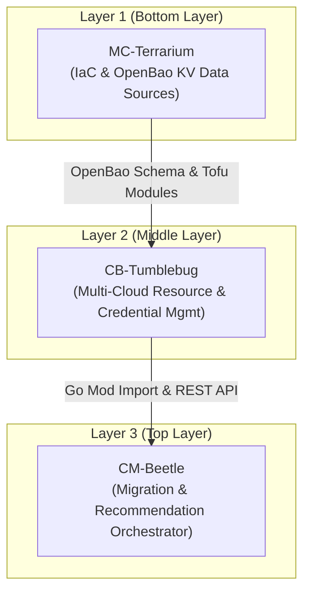

# Plan: NHN RDBMS Credential Support & Layered Version Synchronization

## 1. Overview & Background

To support NHN Cloud RDBMS (RDS for MySQL, RDS for MariaDB) provisioning and data migration across Cloud-Barista sub-frameworks, four new credential keys specified by CB-Spider have been introduced into the credential management workflow:

| Spider Credential Key | YAML Credential Key (Tumblebug) | OpenBao KV Key (Terrarium / OpenTofu) | Purpose / Description |
| :--- | :--- | :--- | :--- |
| `User Access Key` | `User Access Key` | `NHN_USER_ACCESS_KEY` | NHN Cloud API Security Key (Access Key ID) |
| `Secret Access Key` | `Secret Access Key` | `NHN_SECRET_ACCESS_KEY` | NHN Cloud API Security Key (Secret Access Key) |
| `mysqlAppKey` | `mysqlAppKey` | `NHN_MYSQL_APPKEY` | NHN Cloud RDS for MySQL AppKey |
| `mariadbAppKey` | `mariadbAppKey` | `NHN_MARIADB_APPKEY` | NHN Cloud RDS for MariaDB AppKey |

---

## 2. Layered Hierarchy & Release Order

Because Cloud-Barista sub-frameworks maintain strict dependency layering, updates, commits, tags, and module imports must follow this bottom-up sequence:



### Layer Progression & Release Strategy

1. **Layer 1: MC-Terrarium (Independent / Bottom Layer)**
   - Status: Updated immediately.
   - Files: `deployments/docker-compose/openbao/openbao-register-creds.py`, `deployments/docker-compose/openbao/README.md`.
   - Action: Commit & push changes. Prepare release tag when necessary.

2. **Layer 2: CB-Tumblebug (Middle Orchestration Layer)**
   - Status: Updated in sync with Terrarium and Spider.
   - Files:
     - `src/core/csp/csp.go` (`credentialKeyMap["nhn"]`)
     - `init/openbao/openbao-register-creds.py` (`KEY_MAP["nhn"]`)
     - `init/template.credentials.yaml`
     - `init/README.md`
     - `docs/feature_guide/credential-and-connection.md`
     - `src/core/csp/csp_test.go`
   - Action: Commit & push to branch/PR. Once merged and tagged (e.g. `v0.12.x`), the version becomes available for upstream import.

3. **Layer 3: CM-Beetle (Top Migration Layer)**
   - Status: Dependent on Tumblebug & Terrarium release versions.
   - Action: Follow the synchronization steps outlined below.

---

## 3. CM-Beetle Synchronization Steps

When updating CM-Beetle to incorporate the latest Tumblebug and Terrarium versions with NHN RDBMS credential support:

### Step 1: Update Go Module Dependencies
Update `go.mod` in `cm-beetle` to point to the new CB-Tumblebug release (or latest commit):

```bash
# Update cb-tumblebug dependency
go get github.com/cloud-barista/cb-tumblebug@<new-release-tag-or-commit>

# Update mc-terrarium dependency (if indirect/direct reference needs bump)
go get github.com/cloud-barista/mc-terrarium@<new-release-tag-or-commit>

# Tidy dependencies
go mod tidy
```

### Step 2: Verify OpenBao & Kubernetes/Docker Compose Manifests
Ensure CM-Beetle's deployment configurations are aligned:
- Check `deployments/docker-compose/` and `deployments/kubernetes/` to ensure OpenBao container configs and environment bindings match Tumblebug/Terrarium expectations.
- Verify `VAULT_ADDR` and `VAULT_TOKEN` injection for services requiring secret store access.

### Step 3: Test NHN RDBMS Migration Workflows
1. **Credential Registration**:
   - Register NHN credentials containing the new RDBMS keys via Tumblebug `POST /tumblebug/credential`.
   - Verify that OpenBao stores `NHN_USER_ACCESS_KEY`, `NHN_SECRET_ACCESS_KEY`, `NHN_MYSQL_APPKEY`, `NHN_MARIADB_APPKEY` in `secret/data/csp/nhn`.
2. **Beetle Target Database Provisioning & Migration**:
   - Execute CM-Beetle migration pipelines targeting NHN Cloud RDS (MySQL/MariaDB).
   - Ensure Tumblebug RDBMS APIs (`/tumblebug/ns/{nsId}/resources/rdbms`) and Spider drivers successfully authenticate with NHN Cloud APIs.

---

## 4. Verification Checklist for CM-Beetle

- [ ] `mc-terrarium` PR merged and tagged.
- [ ] `cb-tumblebug` PR merged and tagged.
- [ ] `cm-beetle` `go.mod` updated to target Tumblebug/Terrarium version.
- [ ] `go build ./...` and `go test ./...` in `cm-beetle` pass with no errors.
- [ ] End-to-end integration test executed for NHN RDBMS migration scenario.
- [ ] Commit and push CM-Beetle updates with standard conventional commit message.
