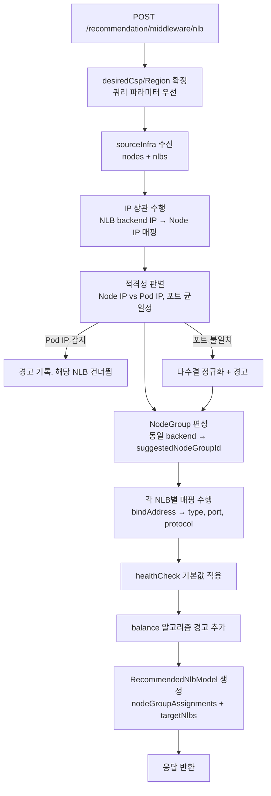
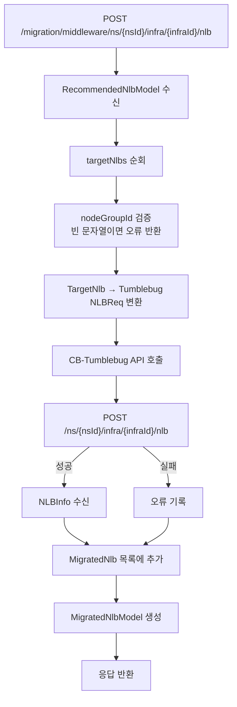

# NLB 추천 및 마이그레이션 계획

## 1. 개요

CM-Beetle은 소스 컴퓨팅 환경의 NLB(Network Load Balancer)를 목표 클라우드 환경으로 마이그레이션하는 기능을 제공합니다.  
소스 환경의 NLB는 HAProxy 소프트웨어 기반으로 구성되며, cm-honeybee Agent를 통해 수집됩니다.  
목표 클라우드에서 NLB 생성은 CB-Tumblebug API를 활용합니다.

### 전체 흐름

```
[소스 환경]                      [CM-Beetle]                         [목표 클라우드]

cm-honeybee Agent
 ├─ Nodes[] (IP, 스펙, Role)  ──┐  (독립 수집)
 └─ NLBs[]  (HAProxy 설정)   ──┘  (선택적)
                                  │
                    ┌─────────────┴──────────────────────┐
                    ▼                                    ▼
     POST /recommendation/infra        POST /recommendation/infraWithNlb
     (기존 유지, 하위 호환)              (신규, NLB 포함 통합 추천)
                    │                                    │
                    ▼                             ┌──────┴────────┐
               nodeGroups[]                 nodeGroups[]      nlbs[]
                    │                             │                 │
                    └──────────┬──────────────────┘                 │
                               ▼                                    ▼
                  POST /migration/infra            POST /migration/middleware/
                  CB-Tumblebug Infra API           ns/{nsId}/infra/{infraId}/nlb
                  (① NodeGroup 생성)               CB-Tumblebug NLB API
                                                   (② NLB 생성, ① 완료 후)
```

> **마이그레이션 순서**: 인프라 마이그레이션 → NLB 마이그레이션 순으로 별도 수행합니다.  
> `nodeGroupId`는 추천 시점에 사전 결정되므로 두 단계 사이 시간 간격이 있어도 일관성이 유지됩니다.

---

## 2. 소스 NLB 원시 데이터 분석

소스는 cm-honeybee Agent가 HAProxy 설정 파일(`/etc/haproxy/haproxy.cfg`)을 파싱하여 수집합니다.  
([참조: cm-honeybee discussion #55](https://github.com/cloud-barista/cm-honeybee/discussions/55))

### 수집 원시 데이터 예시

```json
{
  "haproxy": {
    "version": "HAProxy version 2.4.24-0ubuntu0.22.04.3 2025/10/01 - https://haproxy.org/",
    "config_path": "/etc/haproxy/haproxy.cfg",
    "global": {},
    "defaults": {},
    "frontends": [
      {
        "name": "influxdb_front",
        "bind": "*:9999",
        "default_backend": "influxdb_back",
        "options": {}
      }
    ],
    "backends": [
      {
        "name": "influxdb_back",
        "balance": "roundrobin",
        "options": {},
        "servers": [
          {
            "name": "influx1",
            "address": "127.0.0.1:8086",
            "options": "check"
          },
          {
            "name": "influx2",
            "address": "127.0.0.1:8087",
            "options": "check"
          }
        ]
      }
    ],
    "listens": []
  }
}
```

### 마이그레이션 필요 항목 선별

| 원시 데이터 경로               | 항목 설명                            | 마이그레이션 활용 여부                   |
| ------------------------------ | ------------------------------------ | ---------------------------------------- |
| `frontends[].name`             | 프론트엔드(리스너) 이름              | ✅ NLB 이름 도출에 활용                  |
| `frontends[].bind`             | 바인드 주소:포트 (예: `*:9999`)      | ✅ 리스너 포트, PUBLIC/INTERNAL 구분     |
| `frontends[].default_backend`  | 연결된 백엔드 이름                   | ✅ 백엔드 참조                           |
| `frontends[].options`          | 추가 옵션 (mode 등 포함 가능)        | ✅ 프로토콜 도출                         |
| `backends[].name`              | 백엔드 이름                          | ✅ 참조용                                |
| `backends[].balance`           | 로드밸런싱 알고리즘 (roundrobin 등)  | △ 참고용 (클라우드 NLB는 직접 지정 불가) |
| `backends[].servers[].name`    | 백엔드 서버 이름                     | △ 참고용                                 |
| `backends[].servers[].address` | 백엔드 서버 주소:포트 (IP:Port 합산) | ✅ IP와 Port로 분리하여 각각 활용        |
| `backends[].servers[].options` | 서버 옵션 (`check` = 헬스체크 활성)  | ✅ 헬스체크 활성화 여부                  |
| `haproxy.version`              | HAProxy 버전                         | ❌ 마이그레이션 불필요                   |
| `haproxy.config_path`          | 설정 파일 경로                       | ❌ 마이그레이션 불필요                   |
| `haproxy.global`               | 전역 설정                            | ❌ 현재 수집 미지원                      |
| `haproxy.defaults`             | 기본값 설정 (mode, timeout 포함)     | ❌ 현재 수집 미지원 (Honeybee 협의 필요) |
| `haproxy.listens`              | listen 섹션 (frontend+backend 통합)  | △ 향후 지원 고려                         |

> **참고**: HAProxy `defaults` 섹션의 `mode`(tcp/http) 및 타임아웃 값은 현재 원시 데이터에서 수집되지 않습니다.  
> 프로토콜은 기본값 TCP, 헬스체크 파라미터는 아래 기본값을 적용합니다: interval=10s, timeout=10s, threshold=3.

---

## 3. 소스 NLB 모델 (SourceNlb)

`imdl` 디렉토리의 모델 패턴(특히 `storage-model`)을 참조하여 소스 모델을 도출합니다.  
이 모델은 Honeybee 프로젝트와 협의 후 최종 반영 예정입니다.

> **모델 도출 원칙**: 소스 모델은 목표 NLB 생성에 필요한 항목(Section 4 참조)을 기준으로 역산하여 도출합니다.  
> 소스에서 추출 불가능하거나 클라우드 전용인 항목(`nodeGroupId`, `connectionName`, `scope`)은 소스 모델에 포함하지 않습니다.

> **소프트웨어 독립성 원칙**: 소스 환경에서는 HAProxy, NGINX, Keepalived, Traefik 등 다양한 NLB 소프트웨어가 사용될 수 있습니다.  
> 각 소프트웨어의 원시 데이터(raw data) 형상은 다르지만, **`SourceNlb`는 소프트웨어에 무관하게 동일한 정규화 모델(refined data)** 입니다.  
> 소프트웨어별 파싱 및 정규화 책임은 **cm-honeybee**에 있으며, cm-beetle은 정규화된 `SourceNlb`만 소비합니다.  
> `Software` 필드는 감사·경고 목적의 메타데이터이며, 추천 로직에는 영향을 주지 않습니다.
>
> ```
> cm-honeybee: 소프트웨어별 원시 데이터 파싱 → SourceNlb 정규화
> cm-beetle:   SourceNlb 소비 → TargetNlb 매핑 (소프트웨어 종류 무관)
> ```

### 파일 위치 (예정)

```
imdl/
└── nlb-model/
    ├── model.go   # 최상위 래퍼 모델 (SourceNlbModel, RecommendedNlbModel, MigratedNlbModel)
    └── nlb.go     # 소스/목표 NLB 공유 속성 구조체
```

### 소스 모델 설계

```go
package nlbmodel

// SourceNlbModel is the top-level wrapper for source NLB data
// (received from cm-honeybee Agent, analogous to SourceObjectStorageModel).
// A single HAProxy instance can serve multiple services simultaneously,
// so SourceNlbModel holds a list of SourceNlb entries — one per frontend-backend pair.
type SourceNlbModel struct {
    SourceNlbModel []SourceNlb `json:"sourceNlbModel" validate:"required"`
}

// SourceNlb describes an on-premise NLB (HAProxy) configuration
// extracted from the source computing environment.
type SourceNlb struct {
    Software    string                `json:"software"`              // NLB software type, e.g., "haproxy"
    Listener    NlbListenerProperty   `json:"listener"`              // Frontend listener (maps to NLBReq.listener)
    Backend     NlbBackendProperty    `json:"backend"`               // Backend servers (maps to NLBReq.targetGroup)
    HealthCheck NlbHealthCheckProperty `json:"healthCheck,omitempty"` // Health check settings (maps to NLBReq.healthChecker)
}

// NlbListenerProperty captures the frontend listener of the source NLB.
// Provides data for: NLBReq.listener, NLBReq.type
type NlbListenerProperty struct {
    BindAddress string `json:"bindAddress"` // Bind address: "*" = all interfaces (PUBLIC), specific IP = INTERNAL
    Port        int    `json:"port"`        // Listener port (1–65535)
    Protocol    string `json:"protocol"`    // L4 protocol: "tcp" | "udp" (default: "tcp" if not collected)
}

// NlbBackendProperty captures the backend configuration of the source NLB (HAProxy "backend" section).
// Named "backend" to match HAProxy terminology and avoid confusion with "target" in TargetNlb.
// Provides data for: NLBReq.targetGroup.port, NLBReq.targetGroup.protocol
type NlbBackendProperty struct {
    Name     string              `json:"name"`     // Backend name (HAProxy backend section name)
    Balance  string              `json:"balance"`  // Load balancing algorithm: "roundrobin" | "leastconn" | "source" (note only)
    Protocol string              `json:"protocol"` // Backend protocol: "tcp" | "http" | "https" (default: "tcp" if not collected)
    Servers  []NlbServerProperty `json:"servers"`  // Backend server list
}

// NlbServerProperty captures a single backend server in the source NLB.
// IP holds only the IP address (HAProxy raw "address" field is split into IP + Port).
// Hostname-based backends are not yet supported.
type NlbServerProperty struct {
    Name   string `json:"name"`             // Server name
    IP     string `json:"ip"`               // Server IP address (e.g., "10.0.1.10"); used for IP correlation at recommendation time
    Port   int    `json:"port"`             // Server port (used for NLBReq.targetGroup.port)
    Weight int    `json:"weight,omitempty"` // Traffic weight relative to other servers (reference only; not applied to target NLB)
}

// NlbHealthCheckProperty captures health check settings of the source NLB.
// Fields are optional: HAProxy defaults are not currently collected; defaults are applied at recommendation time.
// Provides data for: NLBReq.healthChecker
type NlbHealthCheckProperty struct {
    Enabled   bool   `json:"enabled"`             // Whether health check is active ("check" option on any server)
    Protocol  string `json:"protocol,omitempty"`  // Health check protocol: "tcp" | "http" (omit → CSP default)
    Port      int    `json:"port,omitempty"`       // Health check port (0 = same as server port)
    Interval  int    `json:"interval,omitempty"`   // Health check interval in seconds (default: 30)
    Timeout   int    `json:"timeout,omitempty"`    // Health check timeout in seconds (default: 5)
    Threshold int    `json:"threshold,omitempty"`  // Unhealthy threshold count (default: 3)
}
```

### OnpremInfra 모델 업데이트

`imdl/on-premise-model/model.go`에 `NLBs` 필드를 추가합니다.  
NLB 관련 속성 구조체(`NlbListenerProperty` 등)는 `nlb-model` 패키지와 협의하여 공유하거나 별도 정의합니다.

```go
// In imdl/on-premise-model/model.go

// NlbProperty represents an NLB instance running on the on-premise environment.
// HostMachineId links this NLB to the node that runs the HAProxy process,
// enabling the recommendation engine to identify which node is the "frontend" host.
type NlbProperty struct {
    HostMachineId string                  `json:"hostMachineId,omitempty"` // ID of the node running HAProxy (cross-ref: Nodes[].Id)
    Software      string                  `json:"software"`                // NLB software: "haproxy"
    Listener      NlbListenerProperty     `json:"listener"`
    Backend       NlbBackendProperty      `json:"backend"`
    HealthCheck   NlbHealthCheckProperty  `json:"healthCheck,omitempty"`
}

type OnpremInfra struct {
    Network    NetworkProperty     `json:"network,omitempty"`
    Nodes      []NodeProperty      `json:"nodes" validate:"required"`
    K8sCluster *K8sClusterProperty `json:"k8sCluster,omitempty"`
    NLBs       []NlbProperty       `json:"nlbs,omitempty"` // On-premise NLB instances (HAProxy-based); one entry per frontend-backend pair
}
```

> **Note**: 하나의 HAProxy 프로세스가 여러 frontend-backend 쌍을 처리하므로, `NLBs`는 리스트입니다.  
> `HostMachineId`는 HAProxy가 실행 중인 노드를 식별하여, 해당 노드를 NLB frontend 역할로 마킹합니다.

### 추출된 소스 NLB 사용자 모델

`### 수집 원시 데이터 예시`의 HAProxy 원시 데이터를 `SourceNlbModel`로 정규화한 결과입니다.  
cm-honeybee 메인테이너와 `### 수집 원시 데이터 예시` 및 이 섹션을 함께 공유하여 소스 NLB 모델 구현을 협의합니다.

**원시 데이터 → 정규화 모델 변환 포인트:**

| 원시 데이터 필드 | 원시값 | 정규화 모델 필드 | 정규화값 |
| --- | --- | --- | --- |
| `frontends[].bind` | `"*:9999"` | `listener.bindAddress` / `listener.port` | `"*"` / `9999` |
| `backends[].servers[].address` | `"127.0.0.1:8086"` | `servers[].ip` / `servers[].port` | `"127.0.0.1"` / `8086` |
| `backends[].servers[].options` | `"check"` | `healthCheck.enabled` | `true` |
| (수집 불가 — HAProxy defaults 섹션) | — | `listener.protocol`, `backend.protocol` | `"tcp"` (기본값) |
| (수집 불가 — HAProxy defaults 섹션) | — | `healthCheck.interval` / `timeout` / `threshold` | `10` / `10` / `3` (기본값) |

```json
{
  "sourceNlbModel": [
    {
      "software": "haproxy",
      "listener": {
        "bindAddress": "*",
        "port": 9999,
        "protocol": "tcp"
      },
      "backend": {
        "name": "influxdb_back",
        "balance": "roundrobin",
        "protocol": "tcp",
        "servers": [
          { "name": "influx1", "ip": "127.0.0.1", "port": 8086 },
          { "name": "influx2", "ip": "127.0.0.1", "port": 8087 }
        ]
      },
      "healthCheck": {
        "enabled": true,
        "interval": 10,
        "timeout": 10,
        "threshold": 3
      }
    }
  ]
}
```

---

## 4. 목표 NLB 모델 (TargetNlb)

CB-Tumblebug NLB 생성 API(`POST /ns/{nsId}/infra/{infraId}/nlb`)의 요청 스키마(`NLBReq`)를 기반으로 합니다.  
추가로 Tumblebug 호출에 필요한 컨텍스트 정보(`@`)를 포함합니다.

### NLB 생성 전제 조건

Tumblebug NLB API는 아래 리소스가 **이미 생성 및 실행 중**이어야 합니다.

```
[1] Namespace (nsId) 존재
    │
    ▼
[2] ConnectionName 유효 — CSP 자격증명 + 리전 정보 설정
    (NLB와 Node는 반드시 동일 ConnectionName이어야 함 → 동일 CSP + 동일 리전 보장)
    │
    ▼
[3] VNet / Subnet 존재 (동일 리전)
    INTERNAL NLB: NLB와 Node가 동일 VNet 필수
    PUBLIC NLB:   동일 VNet 권장 (Tumblebug이 자동 할당)
    │
    ▼
[4] SecurityGroup — Listener port 인바운드 + 헬스체크 포트 허용
    │
    ▼
[5] Infra (infraId) 생성 완료 + 최소 1개 NodeGroup Running 상태
    │
    ▼
[6] nodeGroupId 확정 — targetGroup.nodeGroupId에 지정 (사용자가 직접 채워야 하는 유일한 필드)
```

### Tumblebug NLB 생성 API 요약

**Endpoint**: `POST /ns/{nsId}/infra/{infraId}/nlb`

> `nsId`와 `infraId`는 path parameter입니다. NLB는 기 생성된 Infra에 속하며, 연결 정보(CSP, Region)는 Infra 컨텍스트에서 자동으로 결정됩니다.

**NLBReq 요청 본문**:

```json
{
  "cspResourceId": "string",
  "description": "string",
  "healthChecker": {
    "interval": 10,
    "threshold": 3,
    "timeout": 10
  },
  "listener": {
    "port": "80",
    "protocol": "TCP"
  },
  "scope": "REGION",
  "targetGroup": {
    "nodeGroupId": "g1",
    "port": "80",
    "protocol": "TCP"
  },
  "type": "PUBLIC"
}
```

| 필드                      | 타입   | 필수 | 설명                                               |
| ------------------------- | ------ | ---- | -------------------------------------------------- |
| `type`                    | string | ✅   | `PUBLIC` \| `INTERNAL`                             |
| `scope`                   | string | ✅   | `REGION` \| `GLOBAL`                               |
| `listener.protocol`       | string | ✅   | `TCP` \| `UDP`                                     |
| `listener.port`           | string | ✅   | 리스너 포트 (1–65535)                              |
| `targetGroup.nodeGroupId` | string | ✅   | Infra 내 기 생성된 NodeGroup ID                    |
| `targetGroup.port`        | string | ✅   | 백엔드 포트                                        |
| `targetGroup.protocol`    | string | ✅   | `TCP` \| `HTTP` \| `HTTPS`                         |
| `healthChecker.interval`  | int    | ✅   | 헬스체크 주기 (초)                                 |
| `healthChecker.threshold` | int    | ✅   | 비정상 판단 임계값                                 |
| `healthChecker.timeout`   | int    | ✅   | 헬스체크 타임아웃 (초)                             |
| `description`             | string | ❌   | 설명                                               |
| `cspResourceId`           | string | ❌   | 기존 CSP NLB 리소스 등록 시 사용 (option=register) |

### 목표 모델 설계

```go
// RecommendedNlbModel is the top-level wrapper returned by the NLB recommendation API
// and used as direct input to the NLB migration API.
type RecommendedNlbModel struct {
    RecommendedNlbModel RecommendedNlb `json:"recommendedNlbModel" validate:"required"`
}

// RecommendedNlb is the recommendation result containing one or more target NLB configurations.
type RecommendedNlb struct {
    Status      string        `json:"status"`             // "recommended" | "partial" | "failed"
    Description string        `json:"description"`        // Human-readable summary
    Warnings    []string      `json:"warnings,omitempty"` // e.g., unsupported balance algorithm
    TargetCloud CloudProperty `json:"targetCloud"`        // Target CSP and region (for reference)
    TargetNlbs  []TargetNlb   `json:"targetNlbs"`         // One entry per source HAProxy frontend
}

// TargetNlb is the NLB configuration to create in the target cloud.
// Fields match Tumblebug's NLBReq exactly.
// nsId and infraId are NOT included here — they are supplied as path parameters at migration time.
// connectionName is NOT included — it is derived from the Infra context in Tumblebug.
type TargetNlb struct {
    CspResourceId string              `json:"cspResourceId,omitempty"` // For registering an existing CSP NLB (optional)
    Description   string              `json:"description,omitempty"`
    Scope         string              `json:"scope" validate:"required"`         // REGION | GLOBAL (default: REGION)
    Type          string              `json:"type" validate:"required"`          // PUBLIC | INTERNAL
    Listener      NLBListenerReq      `json:"listener" validate:"required"`
    TargetGroup   NLBTargetGroupReq   `json:"targetGroup" validate:"required"`
    HealthChecker NLBHealthCheckerReq `json:"healthChecker" validate:"required"`
}

// NLBListenerReq is the listener specification for the target NLB (mirrors Tumblebug NLBListenerReq).
type NLBListenerReq struct {
    Protocol string `json:"protocol" validate:"required"` // TCP | UDP
    Port     string `json:"port" validate:"required"`     // "1"–"65535"
}

// NLBTargetGroupReq is the backend specification for the target NLB (mirrors Tumblebug NLBTargetGroupReq).
// "TargetGroup" follows Tumblebug's official naming convention.
type NLBTargetGroupReq struct {
    Protocol    string `json:"protocol" validate:"required"`    // TCP | HTTP | HTTPS
    Port        string `json:"port" validate:"required"`        // Backend port
    NodeGroupId string `json:"nodeGroupId" validate:"required"` // NodeGroup ID in the existing Tumblebug Infra
}

// NLBHealthCheckerReq is the health checker specification for the target NLB (mirrors Tumblebug NLBHealthCheckerReq).
// Note: Tumblebug does not accept protocol or port in healthChecker — only interval, threshold, timeout.
type NLBHealthCheckerReq struct {
    Interval  int `json:"interval"`  // Health check interval in seconds
    Threshold int `json:"threshold"` // Unhealthy threshold count
    Timeout   int `json:"timeout"`   // Health check timeout in seconds
}

// MigratedNlbModel is the top-level wrapper returned by the NLB migration API.
type MigratedNlbModel struct {
    MigratedNlbModel MigratedNlb `json:"migratedNlbModel"`
}

// MigratedNlb contains the result of NLB migration.
type MigratedNlb struct {
    Status      string    `json:"status"`      // "created" | "failed"
    Description string    `json:"description"` // Human-readable summary
    NlbList     []NLBInfo `json:"nlbList"`     // Created NLB information returned from Tumblebug
}

// NLBInfo is copied from CB-Tumblebug's NLBInfo response struct.
// (To be added to imdl/cloud-model/copied-tb-model.go)
type NLBInfo struct {
    Id            string              `json:"id"`
    Name          string              `json:"name"`
    Description   string              `json:"description,omitempty"`
    Scope         string              `json:"scope"`
    Type          string              `json:"type"`
    Listener      NLBListenerInfo     `json:"listener"`
    TargetGroup   NLBTargetGroupInfo  `json:"targetGroup"`
    HealthChecker NLBHealthCheckerInfo `json:"healthChecker"`
    CreatedTime   string              `json:"createdTime,omitempty"`
}

type NLBListenerInfo struct {
    Protocol string `json:"protocol"`
    Port     string `json:"port"`
    IP       string `json:"ip,omitempty"`
    DNSName  string `json:"dnsName,omitempty"`
}

type NLBTargetGroupInfo struct {
    Protocol    string   `json:"protocol"`
    Port        string   `json:"port"`
    NodeGroupId string   `json:"nodeGroupId,omitempty"`
    NodeList    []string `json:"nodeList,omitempty"`
}

type NLBHealthCheckerInfo struct {
    Protocol  string `json:"protocol,omitempty"`
    Port      string `json:"port,omitempty"`
    Interval  int    `json:"interval"`
    Threshold int    `json:"threshold"`
    Timeout   int    `json:"timeout"`
    Result    string `json:"result,omitempty"`
}
```

---

## 5. 소스 → 목표 모델 매핑

| 소스 필드                                   | 목표 필드 (NLBReq)               | 변환 규칙                                                  |
| ------------------------------------------- | -------------------------------- | ---------------------------------------------------------- |
| `listener.bindAddress == "*"`               | `targetNlb.type = "PUBLIC"`      | 와일드카드 바인드 = 외부 공개                              |
| `listener.bindAddress != "*"`               | `targetNlb.type = "INTERNAL"`    | 특정 IP 바인드 = 내부 전용                                 |
| `listener.port`                             | `targetNlb.listener.port`        | int → string 변환                                          |
| `listener.protocol`                         | `targetNlb.listener.protocol`    | `"tcp"` → `"TCP"`, `"udp"` → `"UDP"` (미수집 시 `"TCP"`)   |
| `backend.protocol`                          | `targetNlb.targetGroup.protocol` | `"tcp"` → `"TCP"`, `"http"` → `"HTTP"` (미수집 시 `"TCP"`) |
| `backend.servers[].ip`                      | (IP 상관에 사용됨)               | Node IP 매칭 → NodeGroup 결정. 목표 NLB에 직접 포함 안 됨  |
| `backend.servers[].port` (다수결 정규화 후) | `targetNlb.targetGroup.port`     | 포트 균일성 정규화 후 최종 포트, int → string 변환         |

| `healthCheck.interval` | `targetNlb.healthChecker.interval` | 없으면 `10` (기본값) |
| `healthCheck.timeout` | `targetNlb.healthChecker.timeout` | 없으면 `10` (기본값) |
| `healthCheck.threshold` | `targetNlb.healthChecker.threshold` | 없으면 `3` (기본값) |
| — (기본값) | `targetNlb.scope = "REGION"` | 소스에 해당 개념 없음. 기본값 적용 |
| — (사용자 지정, 마이그레이션 API path param) | `nsId` | 소스에 해당 없음. 마이그레이션 API 경로로 전달 |
| — (사용자 지정, 마이그레이션 API path param) | `infraId` | 소스에 해당 없음. 마이그레이션 API 경로로 전달 |
| — (사용자 지정) | `targetNlb.targetGroup.nodeGroupId` | 소스에 해당 없음. 마이그레이션 API 호출 전 사용자 지정 필요 |

> **제거된 매핑 항목**:
>
> - `healthCheck.protocol`, `healthCheck.port` → Tumblebug `healthChecker`에 해당 필드 없음
> - `connectionName` → `nsId` + `infraId`로 이미 Infra 컨텍스트(CSP, Region) 확정
> - `name` → Tumblebug NLBReq에 name 필드 없음 (Tumblebug 내부에서 자동 결정)
> - `healthCheck.enabled` → `healthChecker`는 항상 구성됨 (Tumblebug 필수 필드)
> - `backend.servers[].weight` → 클라우드 R-NLB는 개별 서버 가중치를 지원하지 않음. 소스 정보 보존용으로만 수집
>
> **`balance` 알고리즘**: HAProxy의 `roundrobin`, `leastconn` 등은 클라우드 NLB에서 직접 지정할 수 없습니다.  
> 매핑 결과의 `warnings` 필드에 해당 사실을 기록합니다.

---

## 6. 인프라 및 NLB 통합 추천 API

기존 `POST /recommendation/infra`와 별도로 `POST /recommendation/infraWithNlb`를 신규 추가합니다.  
기존 엔드포인트는 변경 없이 유지되어 하위 호환성이 완전히 보장됩니다.

### Endpoint

```
POST /beetle/recommendation/infraWithNlb
```

> **Swagger `@Summary` 어노테이션**: `(Preview)` 표기를 포함합니다.
>
> ```go
> // @Summary (Preview) Recommend infrastructure with NLB for cloud migration
> ```

### 기존 API와의 관계

| Endpoint                            | 입력                    | 출력              | 용도                         |
| ----------------------------------- | ----------------------- | ----------------- | ---------------------------- |
| `POST /recommendation/infra`        | OnpremInfra (NLBs 없음) | NodeGroups        | 기존 인프라 추천 — 변경 없음 |
| `POST /recommendation/infraWithNlb` | OnpremInfra (NLBs 포함) | NodeGroups + NLBs | NLB 포함 통합 추천 — 신규    |

### 입력 모델

```go
// OnpremInfra (imdl/on-premise-model/model.go) — NLBs 필드 추가
// POST /recommendation/infra 는 NLBs 필드를 사용하지 않음 (하위 호환)
// POST /recommendation/infraWithNlb 는 NLBs 필드가 필수
type OnpremInfra struct {
    Network    NetworkProperty     `json:"network,omitempty"`
    Nodes      []NodeProperty      `json:"nodes" validate:"required"`
    K8sCluster *K8sClusterProperty `json:"k8sCluster,omitempty"`
    NLBs       []NlbProperty       `json:"nlbs,omitempty"` // infraWithNlb 전용
}
```

### 출력 모델

```go
// RecommendedInfra — 인프라 추천 응답 모델 (imdl/cloud-model/model.go)
// TargetNlbList 는 NLB-aware 추천 시에만 채워지며, 없으면 JSON 에서 생략됩니다.
type RecommendedInfra struct {
    Status                  string             `json:"status"`
    Description             string             `json:"description"`
    TargetCloud             CloudProperty      `json:"targetCloud"`
    TargetInfra             InfraReq           `json:"targetInfra"`
    TargetVNet              VNetReq            `json:"targetVNet"`
    TargetSshKey            SshKeyReq          `json:"targetSshKey"`
    TargetSpecList          []SpecInfo         `json:"targetSpecList"`
    TargetOsImageList       []ImageInfo        `json:"targetOsImageList"`
    TargetSecurityGroupList []SecurityGroupReq `json:"targetSecurityGroupList"`
    TargetNlbList           []NlbReq           `json:"targetNlbList,omitempty"` // NLB-aware 시에만
}
```

### 처리 흐름

```
POST /recommendation/infraWithNlb (OnpremInfra with NLBs[])
         │
         └─ NLBs[] 있음
               │
               ▼
         [Phase 1] 목표 CSP/리전 확정
               │
               ▼
         [Phase 2] IP 상관 + 적격성 판별
               │  backend IP → Node IP 매핑
               │  Pod IP 감지 → 경고, 건너뜀
               │
               ▼
         [Phase 3] 포트 정규화 + 프로토콜 정규화
               │
               ▼
         [Phase 4] NodeGroup 편성
               │  NLB 백엔드 노드: N:1 그룹핑
               │  복수 backend 멤버십: 별도 VM 분리
               │  NLB 무관 노드: 1:1 폴백
               │
               ▼
         [Phase 5] 스펙 이질성 조정 (Upsize 기본값)
               │
               ▼
         [Phase 6] NLB 목표 모델 매핑
               │  bindAddress → PUBLIC/INTERNAL
               │  listener/targetGroup/healthChecker 매핑
               │
               ▼
         [Phase 7] 경고 생성 + 결과 조립
               │
               ▼
         RecommendedInfra { targetInfra.nodeGroups[], targetNlbList[] }
```

### 마이그레이션 분리 원칙

추천은 한 번에 수행하되, 마이그레이션은 순서에 따라 별도로 수행합니다.

```
① POST /recommendation/infraWithNlb    → RecommendedInfra { nodeGroups[], nlbs[] }
         │
         ├─② POST /migration/infra                          → NodeGroups 생성 (infraId 확정)
         │
         └─③ POST /migration/middleware/ns/{nsId}/infra/{infraId}/nlb
                                                             → NLBs 생성 (② 완료 후)
```

`nodeGroupId`는 ①에서 사전 결정 → ②에서 해당 ID로 NodeGroup 생성 → ③에서 즉시 사용 가능.

---

## 7. NLB 단독 추천 API (보류)

> **⚠ 현재 보류 상태입니다.**  
> NLB 추천은 `POST /recommendation/infra`를 통한 통합 추천(Section 6)을 우선 적용합니다.  
> 인프라가 이미 존재하는 상황에서의 단독 NLB 추천은 추후 설계합니다.

### Endpoint (예정)

```
POST /beetle/recommendation/middleware/nlb
```

### Endpoint (예정)

```
POST /beetle/recommendation/middleware/nlb
```

### Query Parameters

| 파라미터        | 타입   | 필수 | 설명                                                   |
| --------------- | ------ | ---- | ------------------------------------------------------ |
| `desiredCsp`    | string | ❌   | 목표 CSP (예: `aws`, `gcp`, `azure`). 본문 값보다 우선 |
| `desiredRegion` | string | ❌   | 목표 리전 (예: `ap-northeast-2`). 본문 값보다 우선     |

> `desiredCsp`와 `desiredRegion`은 쿼리 파라미터 또는 요청 본문의 `desiredCloud`로 지정합니다.  
> 둘 중 최소 하나의 방법으로 반드시 제공해야 합니다.

### Request Body

```json
{
  "desiredCloud": {
    "csp": "aws",
    "region": "ap-northeast-2"
  },
  "sourceInfra": {
    "nodes": [
      {
        "id": "node-a",
        "hostname": "web-01",
        "networkInterfaces": [{ "ipAddress": "10.0.1.10" }]
      },
      {
        "id": "node-b",
        "hostname": "web-02",
        "networkInterfaces": [{ "ipAddress": "10.0.1.20" }]
      },
      {
        "id": "node-c",
        "hostname": "influx-01",
        "networkInterfaces": [{ "ipAddress": "10.0.1.30" }]
      }
    ],
    "nlbs": [
      {
        "hostMachineId": "node-haproxy",
        "software": "haproxy",
        "listener": { "bindAddress": "*", "port": 80, "protocol": "tcp" },
        "backend": {
          "name": "web_back",
          "balance": "roundrobin",
          "protocol": "tcp",
          "servers": [
            { "name": "web1", "ip": "10.0.1.10", "port": 80 },
            { "name": "web2", "ip": "10.0.1.20", "port": 80 }
          ]
        },
        "healthCheck": {
          "enabled": true,
          "interval": 10,
          "timeout": 10,
          "threshold": 3
        }
      },
      {
        "hostMachineId": "node-haproxy",
        "software": "haproxy",
        "listener": { "bindAddress": "*", "port": 9999, "protocol": "tcp" },
        "backend": {
          "name": "influxdb_back",
          "balance": "roundrobin",
          "protocol": "tcp",
          "servers": [{ "name": "influx1", "ip": "10.0.1.30", "port": 8086 }]
        },
        "healthCheck": {
          "enabled": true,
          "interval": 10,
          "timeout": 10,
          "threshold": 3
        }
      }
    ]
  }
}
```

### Response Body

```json
{
  "recommendedNlbModel": {
    "status": "recommended",
    "description": "2 NLB(s) recommended from HAProxy configuration. NodeGroup assignments derived from IP correlation.",
    "warnings": [
      "Load balancing algorithm 'roundrobin' cannot be directly mapped to cloud NLB. CSP default algorithm will be used."
    ],
    "targetCloud": {
      "csp": "aws",
      "region": "ap-northeast-2"
    },
    "nodeGroupAssignments": [
      {
        "suggestedNodeGroupId": "ng-web-backend",
        "nodeIds": ["node-a", "node-b"],
        "sourceBackendName": "web_back"
      },
      {
        "suggestedNodeGroupId": "ng-influx-backend",
        "nodeIds": ["node-c"],
        "sourceBackendName": "influxdb_back"
      }
    ],
    "targetNlbs": [
      {
        "description": "Migrated from HAProxy backend: web_back",
        "scope": "REGION",
        "type": "PUBLIC",
        "listener": { "protocol": "TCP", "port": "80" },
        "targetGroup": {
          "protocol": "TCP",
          "port": "80",
          "nodeGroupId": "ng-web-backend"
        },
        "healthChecker": { "interval": 10, "threshold": 3, "timeout": 10 }
      },
      {
        "description": "Migrated from HAProxy backend: influxdb_back",
        "scope": "REGION",
        "type": "PUBLIC",
        "listener": { "protocol": "TCP", "port": "9999" },
        "targetGroup": {
          "protocol": "TCP",
          "port": "8086",
          "nodeGroupId": "ng-influx-backend"
        },
        "healthChecker": { "interval": 10, "threshold": 3, "timeout": 10 }
      }
    ]
  }
}
```

> `nodeGroupAssignments`는 IP 상관 결과로 사전 결정된 NodeGroup 편성을 나타냅니다.  
> `targetNlbs[].targetGroup.nodeGroupId`는 `nodeGroupAssignments`의 `suggestedNodeGroupId`와 연동됩니다.  
> 인프라 마이그레이션 시 이 ID로 NodeGroup을 생성하면, NLB 마이그레이션 시 즉시 사용 가능합니다.  
> `nsId`와 `infraId`는 마이그레이션 API의 path parameter로 전달되므로 응답 본문에 포함되지 않습니다.

### 처리 흐름



---

## 8. NLB 마이그레이션 API

`RecommendedInfra.targetNlbList[]`를 입력받아 목표 클라우드에 NLB를 생성합니다.  
인프라 마이그레이션(`POST /migration/infra`, ②단계) 완료 후 수행합니다.

### Endpoint

```
POST /migration/middleware/ns/{nsId}/infra/{infraId}/nlb
```

### Path Parameters

| 파라미터  | 타입   | 필수 | 설명                                          |
| --------- | ------ | ---- | --------------------------------------------- |
| `nsId`    | string | ✅   | 네임스페이스 ID                               |
| `infraId` | string | ✅   | 목표 인프라 ID (Tumblebug 내 기 생성된 Infra) |

### Request Body

추천 API 응답인 `RecommendedNlbModel`을 그대로 사용합니다.  
단, `targetNlbs[].targetGroup.nodeGroupId`는 실제 목표 infra의 node group ID로 채워져 있어야 합니다.  
`nsId`와 `infraId`는 path parameter로 지정합니다.

```json
{
  "recommendedNlbModel": {
    "status": "recommended",
    "targetCloud": { "csp": "aws", "region": "ap-northeast-2" },
    "targetNlbs": [
      {
        "description": "Migrated from HAProxy frontend: influxdb_front",
        "scope": "REGION",
        "type": "PUBLIC",
        "listener": { "protocol": "TCP", "port": "9999" },
        "targetGroup": {
          "protocol": "TCP",
          "port": "8086",
          "nodeGroupId": "g1"
        },
        "healthChecker": { "interval": 10, "threshold": 3, "timeout": 10 }
      }
    ]
  }
}
```

### Response Body

```json
{
  "migratedNlbModel": {
    "status": "created",
    "description": "1 NLB(s) created successfully.",
    "nlbList": [
      {
        "id": "nlb-influxdb-front",
        "name": "nlb-influxdb-front",
        "scope": "REGION",
        "type": "PUBLIC",
        "listener": {
          "protocol": "TCP",
          "port": "9999",
          "ip": "54.180.xx.xx",
          "dnsName": "nlb-xxxx.elb.ap-northeast-2.amazonaws.com"
        },
        "targetGroup": {
          "protocol": "TCP",
          "port": "8086",
          "nodeGroupId": "g1",
          "nodeList": ["node-01", "node-02"]
        },
        "healthChecker": {
          "interval": 30,
          "threshold": 3,
          "timeout": 5,
          "result": "Healthy"
        },
        "createdTime": "2026-06-22T10:00:00Z"
      }
    ]
  }
}
```

### 처리 흐름



---

## 9. 구현 단계

### 단계 1: 모델 정의 (`imdl/nlb-model/`)

- [ ] `imdl/nlb-model/nlb.go` 생성 — 소스 NLB 속성 구조체 (`NlbListenerProperty`, `NlbBackendProperty`, `NlbServerProperty`, `NlbHealthCheckProperty`)
- [ ] `imdl/nlb-model/model.go` 생성 — 최상위 래퍼 모델 (`SourceNlbModel`, `RecommendedNlbModel`, `MigratedNlbModel`, `TargetNlb`, `NLBListenerReq`, `NLBTargetGroupReq`, `NLBHealthCheckerReq`)
- [ ] `imdl/cloud-model/copied-tb-model.go`에 Tumblebug 응답 모델 추가 (`NLBInfo`, `NLBListenerInfo`, `NLBTargetGroupInfo`, `NLBHealthCheckerInfo`)
- [ ] `imdl/README.md` 업데이트 — NLB 모델 항목 추가

### 단계 2: NLB 추천 기능 구현

- [ ] `imdl/on-premise-model/model.go` 업데이트 — `OnpremInfra.NLBs []NlbProperty` 필드 추가
- [ ] `pkg/core/recommendation/infra-with-nlb.go` 생성 — 통합 추천 핵심 로직
  - Phase 1: IP 상관 (backend IP → Node IP 매핑)
  - Phase 2: 적격성 판별 (Node IP vs Pod IP, 포트 균일성)
  - Phase 3: 포트/프로토콜 정규화 (다수결)
  - Phase 4: NodeGroup 편성 (NLB-aware N:1, 복수 backend 분리, 1:1 폴백)
  - Phase 5: 스펙 이질성 조정 (Upsize 기본값)
  - Phase 6: NLB 목표 모델 매핑 (bindAddress→type, port, protocol, healthChecker)
  - Phase 7: 경고 생성 및 결과 조립
- [ ] `pkg/api/rest/controller/recommendation-infra-with-nlb.go` 생성 — 핸들러
  - 쿼리 파라미터 `desiredCsp`, `desiredRegion` 우선 처리
  - `RecommendedInfra` 응답 반환
- [ ] 라우팅 등록: `POST /recommendation/infraWithNlb`
- [ ] Swagger 문서 업데이트

### 단계 3: NLB 마이그레이션 기능 구현

- [ ] `pkg/core/migration/nlb.go` 생성 — Tumblebug NLB 생성 호출 로직
  - `nodeGroupId` 유효성 검증
  - `TargetNlb` → Tumblebug `NLBReq` 변환
  - `POST /ns/{nsId}/infra/{infraId}/nlb` 호출
  - 결과 `NLBInfo` 수집 및 `MigratedNlbModel` 조립
- [ ] `pkg/client/tumblebug/nlb.go` 생성 — Tumblebug NLB API 클라이언트
- [ ] `pkg/api/rest/controller/migration-nlb.go` 생성 — 마이그레이션 API 핸들러
- [ ] 라우팅 등록: `POST /migration/middleware/ns/:nsId/infra/:infraId/nlb`
- [ ] Swagger 문서 업데이트

### 단계 4: 검증 및 테스트

- [ ] 단위 테스트 — 매핑 로직 (`bindAddress` 파싱, 포트 추출, 프로토콜 변환, 기본값 적용)
- [ ] 통합 테스트 — Tumblebug Mock 서버 활용
- [ ] E2E 테스트 — 실제 클라우드 환경에서 NLB 생성 확인
- [ ] `docs/test-results-nlb.md` 작성 — 테스트 결과 기록

### 단계 5: Honeybee 협의 및 모델 반영

- [ ] cm-honeybee 팀과 `SourceNlb` 모델 협의
  - HAProxy `defaults.mode` (tcp/http) 파싱 지원 요청 → `NlbListenerProperty.Protocol`, `NlbBackendProperty.Protocol` 자동 수집
  - HAProxy `defaults` 타임아웃 값 수집 지원 요청 → `NlbHealthCheckProperty` 자동 수집
  - `listens` 섹션 지원 계획 논의
- [ ] 협의 결과 반영하여 모델 및 매핑 로직 업데이트

---

## 10. 제약 사항 및 고려 사항

| 항목                             | 내용                                                                                                                     |
| -------------------------------- | ------------------------------------------------------------------------------------------------------------------------ |
| **R-NLB 마이그레이션 범위**      | Node-level LB 전용. 백엔드가 Node IP이고 동일 포트인 경우에만 대상. App/Pod 레벨은 범위 외                               |
| **Pod IP 감지**                  | 백엔드 IP가 `OnpremInfra.Nodes[]`의 IP와 매칭되지 않으면 Pod IP로 판단 → 경고 후 해당 NLB 건너뜀                         |
| **포트 균일성 정규화**           | 백엔드 서버 포트가 다른 경우 다수결로 정규화. 동점 시에만 사용자 개입 요청. 정규화 내용은 경고 기록                      |
| **전체 NodeGroup 노드가 백엔드** | R-NLB는 `targetGroup.nodeGroupId` 지정 시 NodeGroup의 모든 노드가 백엔드가 됨. NodeGroup 편성이 NLB 범위와 일치해야 함   |
| **복수 backend 멤버십**          | 소스 노드가 여러 NLB backend에 속한 경우 backend별 별도 VM 생성. 소스 1노드 → 목표 N VM (backend 수만큼). 안내 문구 제공 |
| **스펙 이질성 조정 전략**        | 동일 NodeGroup 내 스펙 불일치 시 Upsize(기본값) · Downsize · Manual 중 선택. 조정 내용은 경고로 기록                     |
| **NLB 무관 노드**                | NLB backend에 속하지 않는 노드는 기존 1:1 NodeGroup 편성 유지 (하위 호환)                                                |
| **로드밸런싱 알고리즘**          | 클라우드 NLB는 roundrobin/leastconn 등을 직접 지정할 수 없음. CSP 기본 알고리즘 사용                                     |
| **프로토콜 미수집**              | HAProxy `defaults.mode`가 현재 수집 안 됨. 기본값 TCP 적용 (Honeybee 개선 후 자동 수집 예정)                             |
| **헬스체크 파라미터**            | Tumblebug `healthChecker`는 interval/threshold/timeout만 지원. protocol/port 지정 불가                                   |
| **멀티 서비스 HAProxy**          | HAProxy 하나가 여러 서비스에 대해 동시에 LB 수행 → `NLBs[]` 리스트, 각각 별도 R-NLB로 생성됨                             |
| **내부 서버 주소**               | 백엔드 서버의 IP는 목표 클라우드에서 무의미함. IP 상관 후 `nodeGroupId`로 대체                                           |
| **nodeGroupId 사전 결정**        | 추천 시 IP 상관으로 `suggestedNodeGroupId` 결정. 인프라 마이그레이션 시 동일 ID로 NodeGroup 생성                         |
| **NLB 이름**                     | Tumblebug NLBReq에 name 필드 없음. NLB 이름은 Tumblebug 내부에서 자동 결정됨                                             |
| **connectionName 불필요**        | `nsId` + `infraId` path param으로 Infra 컨텍스트(CSP, Region) 자동 결정. 별도 지정 불필요                                |
| **NLB 생성 전제 조건**           | Namespace, VNet, SecurityGroup, Infra, NodeGroup이 모두 사전 생성되어 있어야 함                                          |
| **동일 리전 요구**               | NLB와 NodeGroup은 동일 Infra에 속하므로 자동으로 동일 리전 보장됨                                                        |
| **`listens` 섹션**               | HAProxy listen 섹션(frontend+backend 통합)은 현재 미지원, 향후 확장 예정                                                 |
| **SSL/TLS 종단**                 | HTTPS 종단(SSL offloading)은 현재 계획에서 제외, 향후 확장 고려                                                          |
| **소프트웨어 NLB**               | Tumblebug의 `mcSwNlb` (소프트웨어 NLB) API는 별도 확장으로 고려                                                          |

---

## 11. NodeGroup 편성을 위한 소스 정보 추출/마킹 전략

### 10.1 핵심 원칙

HAProxy 설정 파일은 이미 NodeGroup 편성 정보를 내포하고 있습니다.  
**별도의 마킹 없이 IP 상관(IP Correlation)으로 NodeGroup을 결정할 수 있습니다.**

```
HAProxy backend 설정 = "이 IP들이 동일 서비스를 위해 묶인 노드들"
→ 동일 backend의 서버 IP = 동일 NodeGroup 후보
```

### 10.2 데이터 수집 (cm-honeybee Agent)

추가 마킹 없이 기존 수집 데이터만으로 충분합니다.

| 수집 주체          | 수집 항목                              | 모델 위치                                      |
| ------------------ | -------------------------------------- | ---------------------------------------------- |
| 각 노드 Agent      | IP 주소, CPU/메모리 스펙, K8s Role     | `OnpremInfra.Nodes[].NetworkInterfaces[].IP`   |
| HAProxy 노드 Agent | frontend/backend 설정, backend 서버 IP | `OnpremInfra.NLBs[].Backend.Servers[].Address` |

> HAProxy를 실행 중인 노드는 `NlbProperty.HostMachineId`로 식별합니다.  
> 이 노드가 HAProxy "frontend" 역할을 담당합니다.

### 10.3 IP 상관 알고리즘 (추천 엔진)

```
입력:
  OnpremInfra.Nodes[]          (IP 목록)
  OnpremInfra.NLBs[]           (backend 서버 IP 목록)

Step 0: IP 인덱스 구축
  ipToNode = map[IP] → NodeProperty
  for each node in Nodes:
      for each iface in node.NetworkInterfaces:
          ipToNode[iface.IP] = node

Step 1: NLB별 적격성 판별
  for each nlb in NLBs:
      resolvedNodes = []
      for each server in nlb.Backend.Servers:
          if server.IP in ipToNode:
              resolvedNodes.append(ipToNode[server.IP])
          else:
              warn("Pod IP or unknown IP: " + server.IP + " — skipped")

      if len(resolvedNodes) == 0: skip this NLB

Step 2: 포트 균일성 확인 및 정규화
  ports = collect unique ports from nlb.Backend.Servers
  if len(ports) == 1:
      resolvedPort = ports[0]           // 동일 포트 — 정상
  elif majority port exists:
      resolvedPort = majorityPort       // 다수결 정규화 + 경고
  else:
      request user input → resolvedPort // 동점 — 사용자 개입

Step 3: NodeGroup ID 사전 결정
  suggestedNodeGroupId = "ng-" + nlb.Backend.Name
  // 예: "ng-web-back", "ng-influxdb-back"

출력:
  NodeGroupAssignment {
      suggestedNodeGroupId: "ng-web-back"
      nodeIds: ["node-a", "node-b"]
      sourceBackendName: "web_back"
      resolvedPort: 80
  }
```

### 10.4 NodeGroup 편성 규칙

#### 노드 분류: NLB 관련 vs NLB 무관

```
소스 노드 분류:

  [NLB 백엔드 노드]              [NLB 무관 노드]
  NLB backend IP과 매칭되는 노드   그 외 모든 노드
         │                               │
         ▼                               ▼
    N개 → NodeGroup 1개            1개 → NodeGroup 1개
    (N:1 그룹핑)                   (1:1, 기존 동작과 동일)
```

#### 편성 우선순위

| 우선순위         | 기준               | 설명                                        |
| ---------------- | ------------------ | ------------------------------------------- |
| **1 (Hard)**     | NLB backend 멤버십 | 동일 backend의 노드는 반드시 동일 NodeGroup |
| **2 (Medium)**   | K8s Role           | `k8s-control-plane` / `k8s-worker` 구분     |
| **3 (Soft)**     | 일반 Role          | 동일 역할의 노드를 같은 그룹으로 묶음       |
| **4 (Fallback)** | 1:1                | NLB 무관 단독 노드는 각자 NodeGroup         |

#### 엣지 케이스: 복수 NLB backend 멤버십

소스 노드가 여러 NLB backend에 동시에 속한 경우, **backend별로 별도 VM을 생성**합니다.  
소스에서 하나의 서버가 여러 서비스를 담당하던 것을 목표에서 전용 VM으로 분리합니다.

```
소스:
  node-A (10.0.1.10) ─┬─ web_back   [A, B]
  node-B (10.0.1.20) ─┘
  node-A (10.0.1.10) ─┬─ api_back   [A, C]
  node-C (10.0.1.30) ─┘

목표 (별도 VM으로 분리):
  NodeGroup-web:  [vm-A1, vm-B]   ← vm-A1 은 node-A에서 마이그레이션
  NodeGroup-api:  [vm-A2, vm-C]   ← vm-A2 도 node-A에서 마이그레이션 (별도 VM)

소스 노드 수: 3개 (A, B, C)
목표 VM 수:  4개 (A1, A2, B, C)  ← backend 수만큼 증가
```

**안내 문구 (추천 결과 warnings[] 포함):**

```
⚠ 소스 노드 node-A(10.0.1.10)가 web_back, api_back 두 backend에 속해 있습니다.
  목표 클라우드에서 별도 VM으로 분리됩니다:
    - vm-A-web → NodeGroup-web (web_back 담당)
    - vm-A-api → NodeGroup-api (api_back 담당)
  소스 노드 node-A의 애플리케이션이 두 VM 모두에 배포되어야 합니다.
  VM이 소스보다 1개 더 생성됩니다.
```

### 10.5 스펙 이질성 처리

NodeGroup은 동일 스펙의 노드로 구성되어야 합니다 (Tumblebug 제약).  
동일 backend 노드들의 스펙이 다른 경우, 아래 세 가지 전략 중 선택합니다.

| 전략         | 설명               | 적용 스펙                 | 기본값    |
| ------------ | ------------------ | ------------------------- | --------- |
| **Upsize**   | 최대 스펙으로 통일 | `max(vcpu)`, `max(memGB)` | ✅ 기본값 |
| **Downsize** | 최소 스펙으로 통일 | `min(vcpu)`, `min(memGB)` | -         |
| **Manual**   | 사용자가 직접 지정 | 사용자 입력값             | -         |

```
예시 (기본값 Upsize):

web_back:
  node-a: 4 vCPU, 8GB  ─┐
  node-b: 2 vCPU, 4GB  ─┴─→ NodeGroup 스펙: 4 vCPU, 8GB
                              경고: "node-b spec adjusted from 2c/4GB to 4c/8GB (upsize)"
```

**모델 표현:**

```go
type NodeGroupSpecStrategy struct {
    Strategy     string `json:"strategy"`               // "upsize" | "downsize" | "manual"
    ResolvedVcpu int    `json:"resolvedVcpu"`            // 최종 결정된 vCPU
    ResolvedMemGB int   `json:"resolvedMemGB"`           // 최종 결정된 메모리 (GB)
    OverrideVcpu int    `json:"overrideVcpu,omitempty"`  // Manual 전략 시 사용자 입력값
    OverrideMemGB int   `json:"overrideMemGB,omitempty"` // Manual 전략 시 사용자 입력값
}
```

### 10.6 추천 출력에서의 NodeGroup 표현

```go
// RecommendedNodeGroup은 추천 결과의 NodeGroup 편성 정보입니다.
// NLB 관련 노드(N:1)와 NLB 무관 노드(1:1) 모두 동일 구조로 표현됩니다.
type RecommendedNodeGroup struct {
    NodeGroupId    string               `json:"nodeGroupId"`             // 인프라 마이그레이션 시 사용할 ID
    NodeCount      int                  `json:"nodeCount"`               // 목표 클라우드에서 생성할 VM 수
    SourceNodeIds  []string             `json:"sourceNodeIds"`           // 소스 노드 추적용 (traceability)
    GroupingReason string               `json:"groupingReason"`          // "nlb-backend" | "k8s-role" | "role" | "fallback"
    RelatedNlbs    []string             `json:"relatedNlbs,omitempty"`   // 이 NodeGroup을 참조하는 NLB 목록
    SpecStrategy   NodeGroupSpecStrategy `json:"specStrategy"`           // 스펙 이질성 조정 결과
}

// NodeGroupAssignment는 IP 상관으로 결정된 NLB backend → NodeGroup 매핑입니다.
type NodeGroupAssignment struct {
    NodeGroupId       string   `json:"nodeGroupId"`       // 인프라 마이그레이션 시 사용할 NodeGroup ID
    SourceNodeIds     []string `json:"sourceNodeIds"`     // 이 NodeGroup에 속할 소스 노드 ID 목록
    SourceNodeIps     []string `json:"sourceNodeIps"`     // 소스 노드 IP 목록 (역추적용)
    SourceBackendName string   `json:"sourceBackendName"` // 매핑된 backend 이름
    ResolvedPort      int      `json:"resolvedPort"`      // 정규화된 backend 포트
    SpecStrategy      NodeGroupSpecStrategy `json:"specStrategy"` // 스펙 조정 전략
}
```

**추천 결과 예시 (NLB 관련 + 무관 노드 혼재):**

```json
{
  "recommendedInfra": {
    "nodeGroups": [
      {
        "nodeGroupId": "ng-web-backend",
        "nodeCount": 2,
        "sourceNodeIds": ["node-a", "node-b"],
        "groupingReason": "nlb-backend",
        "relatedNlbs": ["web_nlb"],
        "specStrategy": {
          "strategy": "upsize",
          "resolvedVcpu": 4,
          "resolvedMemGB": 8
        }
      },
      {
        "nodeGroupId": "ng-influx-backend",
        "nodeCount": 1,
        "sourceNodeIds": ["node-c"],
        "groupingReason": "nlb-backend",
        "relatedNlbs": ["influx_nlb"],
        "specStrategy": {
          "strategy": "upsize",
          "resolvedVcpu": 8,
          "resolvedMemGB": 16
        }
      },
      {
        "nodeGroupId": "ng-node-d",
        "nodeCount": 1,
        "sourceNodeIds": ["node-d"],
        "groupingReason": "fallback",
        "specStrategy": {
          "strategy": "upsize",
          "resolvedVcpu": 2,
          "resolvedMemGB": 4
        }
      }
    ],
    "nlbs": [
      {
        "description": "Migrated from HAProxy backend: web_back",
        "targetGroup": {
          "nodeGroupId": "ng-web-backend",
          "port": "80",
          "protocol": "TCP"
        }
      }
    ]
  }
}
```

### 10.7 전체 흐름 요약

```
[소스 환경]              [CM-Beetle 추천 엔진]            [CM-Beetle 마이그레이션]

OnpremInfra
  Nodes[] (IP 포함)
  NLBs[]  (backend IP)
      │
      ▼
  IP 상관 수행
  ├─ Node IP 매칭       → NodeGroupAssignment[]
  ├─ 포트 정규화         → resolvedPort
  └─ 스펙 조정           → specStrategy
      │
      ▼
  RecommendedInfra
  ├─ targetInfra.nodeGroups[]: nodeGroupId (사전 결정)
  └─ targetNlbList[]:          nodeGroupId (사전 결정)
      │
      ├─────────────────────────────────────►  ① 인프라 마이그레이션
      │                                         POST /migration/infra
      │                                         nodeGroupId로 NodeGroup 생성
      │
      └─────────────────────────────────────►  ② NLB 마이그레이션 (① 완료 후)
                                                POST /migration/middleware/ns/{nsId}/infra/{infraId}/nlb
                                                nodeGroupId 이미 확정 — 즉시 사용 가능
```

---

## 12. 연관 문서 및 참조

- [cm-honeybee discussion #55 — HAProxy 수집 데이터 예시](https://github.com/cloud-barista/cm-honeybee/discussions/55)
- [CB-Tumblebug Swagger v0.12.15](https://raw.githubusercontent.com/cloud-barista/cb-tumblebug/v0.12.15/src/interface/rest/docs/swagger.yaml)
- [imdl README — 인프라 모델 디렉토리 가이드](../../imdl/README.md)
- [Object Storage Feature Guide — API 패턴 참조](../feature-guide/object-storage-migration-feature-guide.md)
- [API Development Guide](../api-development-guide.md)
